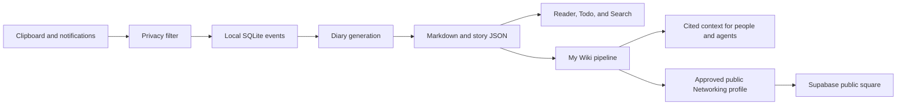

# KnowYou

KnowYou is a local-first macOS app that turns the context you already create on your computer into a source-linked daily diary and a reusable personal knowledge base.

It captures clipboard text and supported Notification Center records, applies a privacy filter before persistence, stores data locally, and can use either a local fallback or an optional LLM engine to produce structured daily stories. My Wiki turns those stories and user-selected local sources into cited context that people and AI agents can reuse.

> Project status: active development. Review the privacy boundary and back up important data before using KnowYou with sensitive work. The repository is licensed under GPL-3.0; see [LICENSE](LICENSE) and the current [open-source readiness review](docs/open-source-readiness.md).

## What is included

- Native SwiftUI/AppKit macOS app
- Local SQLite event and run storage through GRDB
- Clipboard and Notification Center capture with pre-persistence filtering
- Daily Markdown and structured `.story.json` output
- Local search across Diary, Todo, My Wiki, and imported sources
- My Wiki ingestion, cited retrieval, and built-in MCP/CLI access for agents
- Optional LLM engines through API providers or local Claude, Codex, Gemini, and OpenClaw CLIs
- Optional Networking profile and public-square experience, with private My Wiki evidence kept on the Mac
- Sparkle-based direct updates and maintainer-only notarized release tooling

## Privacy model

KnowYou is local-first, not local-only:

- Raw capture, SQLite storage, diary files, source indexes, and My Wiki live on the user's Mac by default.
- Clipboard and notification text passes through `PrivacyFilter` before it reaches SQLite.
- API credentials and Networking session/device credentials are stored in macOS Keychain, not in repository files or `UserDefaults`.
- Enabling an external LLM sends the prepared diary or My Wiki prompt to that provider.
- Enabling Networking sends approved public profile data and public interactions to the configured Supabase-backed service. Private My Wiki evidence and private match reasoning must remain local.

See [PRIVACY.md](PRIVACY.md) for the user-facing policy and [SECURITY.md](SECURITY.md) for vulnerability reporting.

## Architecture at a glance



The macOS app is orchestrated by `AppState`, with services separated by capture, storage, summary, My Wiki, search, sync, reminders, and Networking responsibilities. The bundled TypeScript My Wiki pipeline lives under `ThirdParty/llm_wiki`; the optional public-square web app lives under `NetworkingWeb`.

Read [docs/architecture.md](docs/architecture.md) for implementation detail and [docs/requirements-spec.md](docs/requirements-spec.md) for current product contracts.

## Repository map

| Path | Purpose |
| --- | --- |
| `KnowYou/` | Native macOS application code |
| `KnowYouTests/` | XCTest unit and integration coverage |
| `ThirdParty/llm_wiki/` | Bundled My Wiki ingestion and retrieval pipeline |
| `NetworkingWeb/` | Optional Next.js/Supabase public square |
| `Tools/MyWikiMCP/` | Legacy standalone MCP adapter; the app also has a built-in MCP mode |
| `scripts/` | Development, verification, packaging, and release scripts |
| `docs/` | Architecture, requirements, operations, and historical design records |

AI agents should start with [docs/agent-guide.md](docs/agent-guide.md) before changing code.

## Requirements

- macOS 14 or later
- A recent Xcode with the macOS SDK and Swift 6 support
- Node.js and npm for the bundled My Wiki runner and Networking Web
- Full Disk Access only if Notification Center import is enabled

GRDB and Sparkle are resolved through Swift Package Manager when the Xcode project is opened or built.

## Build the macOS app

```bash
git clone https://github.com/gift-is-coding/know-you.git
cd know-you
xcodebuild build -scheme KnowYou -destination 'platform=macOS'
```

For a fresh worktree-specific development build that also embeds MyWikiRunner:

```bash
./scripts/run-dev-app.sh --fresh
```

The script uses `.derived-data/dev` inside the worktree so it never opens a stale app from another checkout. If local signing is unavailable, it retries the development build without code signing.

Runtime data defaults to:

- Database: `~/Library/Application Support/KnowYou/events.sqlite`
- Vault: `~/Library/Application Support/KnowYou/Vault`

## Configure optional services

LLM API tokens should be entered in the app's Settings UI. They are saved to macOS Keychain. Do not put real credentials in `KnowYou/Config/Secrets.example.xcconfig` or any tracked file.

For Networking Web development:

```bash
cd NetworkingWeb
cp .env.example .env.local
npm ci
npm run dev
```

Use a dedicated development Supabase project. Production configuration is rejected in local development unless the explicit one-off override documented in [NetworkingWeb/README.md](NetworkingWeb/README.md) is set.

## Verify changes

macOS app:

```bash
xcodebuild test -scheme KnowYou -destination 'platform=macOS'
xcodebuild build -scheme KnowYou -destination 'platform=macOS'
```

Networking Web:

```bash
cd NetworkingWeb
npm ci
npm audit --audit-level=high
npm run typecheck
npm run lint
npm test -- --run
```

Bundled My Wiki runner:

```bash
cd ThirdParty/llm_wiki
npm ci
npm audit --audit-level=high
npm run typecheck
npm run test:mocks
```

Bundled My Wiki desktop backend:

```bash
cd ThirdParty/llm_wiki/src-tauri
cargo check --locked
cargo test --locked
```

Standalone My Wiki MCP adapter:

```bash
cd Tools/MyWikiMCP
npm ci
npm audit --audit-level=high
npm test
```

Some real-LLM, Supabase integration, notarization, and GUI checks require credentials or machine capabilities and are intentionally separate from the deterministic default suite.

## Contributing

Read [CONTRIBUTING.md](CONTRIBUTING.md) before opening a change. Keep changes focused, add tests first for behavior changes, preserve local user state during app verification, and never commit credentials, personal diary data, or generated runtime state.

Third-party source and binary obligations are tracked in [THIRD_PARTY_NOTICES.md](THIRD_PARTY_NOTICES.md). The bundled PDFium binaries have exact provenance, checksums, and license notices.

## License

KnowYou is licensed under the [GNU General Public License v3.0](LICENSE). If you distribute a modified version, review the GPL source-availability and notice obligations before publishing it. Third-party components remain subject to the licenses listed in [THIRD_PARTY_NOTICES.md](THIRD_PARTY_NOTICES.md).

## Release signing

Public contributors do not need the maintainer's Apple identity. A notarized release requires the maintainer to provide signing configuration through environment variables and a local Keychain profile; the repository contains no private signing credential.

See [docs/release-signing.md](docs/release-signing.md). Do not run publish scripts against production services from an unreviewed branch.

## Community and contact

- [Community guide](COMMUNITY.md)
- [Discord](https://discord.gg/ZrqF5jwQ)
- [X / Twitter](https://x.com/TianfuW49629)
- Email: `cestlouiswu@gmail.com`
