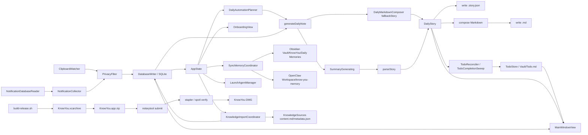
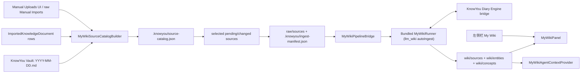

# KnowYou 架构文档

本文档描述当前工作区对应的真实实现架构，目标是解释系统现在如何运行，而不是定义未来版本的设想。

## 1. 项目定位

KnowYou 是一个原生 macOS 应用，用来被动采集用户当天的电脑上下文，并生成按天组织的日记材料。

当前实现是一个本地优先、单机运行的桌面产品，核心能力包括：

- 监听剪贴板
- 从本机 Notification Center 数据库导入通知历史
- 在落库前执行隐私过滤
- 使用 SQLite 持久化原始事件与运行记录
- 为每天生成两种输出工件：
  - `YYYY-MM-DD.story.json`：UI 主读取工件
  - `YYYY-MM-DD.md`：Markdown 导出工件
- 维护统一 Todo inbox，把每日候选待办归集到 `Vault/Todo.md`
- 在主界面中以 story-first 的方式阅读每天内容，并查看段落对应的原始来源
- 提供视觉化 `Home` 入口，提醒用户保持应用后台运行，并给出日记检查节奏、主要功能跳转和最近 3 天补生成入口
- 提供主窗口一级 `Search` 入口，用本地关键词匹配搜索日记、My Wiki 实体/概念、已引入 source 和统一 Todo
- 提供 `Networking` 一级入口，用本地 My Wiki + LLM 生成多场景 profile，并通过本地 agent/MCP 连接 KnowYou 自有公开平台

## 2. 系统总览

当前运行时系统由 7 层组成，另有一条独立的分发链路：

1. 采集层：剪贴板监听、通知数据库读取与导入
2. 存储与调度层：SQLite、run 记录、`Vault/Todo.md`、刷新日志、today-only 定时自动化
3. 生成层：本地 fallback story 生成、可选云端/CLI 总结器、Markdown 组合
4. 连接器层：Daily Memory Export 单向导出、Add Source 本地引用扫描、prompt-backed 外部目录、LaunchAgent 定时运行
5. 提醒层：晚间回顾 planner、本地通知权限与调度
6. 界面层：真实三栏阅读器上的 onboarding coachmarks、设置页、菜单栏状态入口、About & Community 对外入口
7. Networking 层：本地原生 SwiftUI cockpit、My Wiki 派生 profile、KnowYou 自有公开平台、Supabase RLS 契约和 agent MCP 写入入口

分发链路包括 Developer ID release archive、notarytool notarization、stapled app 验证与双击自移动安装 DMG 发布。

## 2.1 发布与分发

当前项目已经补上一条独立于本地调试签名的外部分发路径：

- Release 构建使用 `Developer ID Application`
- Release 启用 hardened runtime
- 分发脚本通过 `scripts/build-release.sh`、`scripts/embed-mywiki-runner.sh`、`scripts/notarize-release.sh`、`scripts/build-dmg.sh`、`scripts/verify-release.sh` 串起 archive、内置 MyWikiRunner、压缩、notarize、staple、Gatekeeper 验证与 DMG 打包
- Apple notarization 凭据通过本机 keychain 中的 `notarytool` profile 管理，而不是保存在仓库里

这条链路的目标是让仓库能稳定产出可上传到下载页的 macOS DMG，同时不影响 Debug/测试阶段的日常签名配置。DMG 内只放真实 `.app` 和最小 Finder metadata；用户双击 DMG 内 app 时，交互式启动会复制到 `/Applications/KnowYou.app` 或 `/Applications/KnowYou New User.app`、打开目标 app，并退出临时实例。复制失败时不阻塞启动，仍回到 onboarding 的手动安装兜底。

## 3. 运行时入口

### 3.1 App 启动

应用入口是 [KnowYouApp.swift](/Users/wutianfu/Code/know-you/KnowYou/KnowYouApp.swift)。

启动后会创建单例式的 `AppState`，并挂接三个界面入口：

- 主窗口（由 `KnowYouMainWindowPresenter` 通过 AppKit `NSWindowController` 显式创建和复用）
- 菜单栏入口
- Settings 窗口

正常交互式启动时，`KnowYouApp` 会调用 `AppState.ensureDefaultLaunchAtLogin()`。该方法通过 `SMAppService.mainApp` 尝试把主应用注册为 macOS 登录项，并用 `launchAtLoginDefaultRegistrationAttempted` 避免在用户关闭后反复自动打开。

如果用户尚未完成 onboarding，则仍然进入真实主阅读器，但会叠加 Demo Day + coachmark 引导；否则直接进入正常主阅读器。

菜单栏中的 `Open KnowYou` 会显式调用 `KnowYouMainWindowPresenter` 并激活应用，因此主窗口既能由正常启动拉起，也能由菜单栏重新唤起。当前实现不再同时保留 SwiftUI `Window` 场景和 AppKit 兜底窗口，避免 fresh build 后出现重复窗口或主窗口恢复失败。

### 3.2 AppState 作为编排中心

[AppState.swift](/Users/wutianfu/Code/know-you/KnowYou/App/AppState.swift) 是当前实现的运行时编排中心，负责：

- 创建并持有 `AppEnvironment`
- 启动剪贴板监听
- 启动 launch-time automation、30 秒通知补同步与 3 小时定时自动化
- 管理主应用的 `Launch at Login` 默认注册与 Settings 开关
- 维护 UI 状态与服务状态
- 管理选中日期、选中 story、选中段落及其来源事件
- 触发“按天刷新”、今日通知补同步与 today-only 自动刷新
- 维护统一 Todo inbox 状态、每日候选待办的归集状态，以及日记刷新后的自动归集/完成 sweep
- 持久化 onboarding 进度，并在首次确认后触发一次性最近 3 天 bootstrap；已完成 onboarding 但升级时错过 bootstrap 的老用户，会通过最近 3 天缺失检测重新进入同一补生成路径

`AppEnvironment` 本身则负责组装主要依赖，包括数据库、隐私过滤器、采集器、composer 与 summarizer，见 [AppEnvironment.swift](/Users/wutianfu/Code/know-you/KnowYou/App/AppEnvironment.swift)。

当前 `AppState` 还负责日记引擎状态编排：

- 持有 `SummarizerConfig`
- 暴露 `defaultEngine`
- 为五个引擎维护 `engineStatuses`
- 触发 `refreshEngineStatuses()`、`retestEngine(_:)`、`retestAllEngines()`
- 保证只有绿色引擎可以成为默认项，`.none` 是唯一允许的禁用例外
- 仅当默认项当前为 `.none` 且用户没有显式保持 `None` 时，按 `Claude -> Codex -> Gemini -> Openclaw -> OpenAI` 的固定优先级自动挑选最高优先级绿色引擎

当前 `AppState` 也负责全局 diary prompt 状态：

- 持有并持久化 `SummarizerConfig.globalDiaryPromptOverride`
- 为主窗口右上角的 `Edit Prompt` sheet 提供 apply / restore default 动作
- 在真实生成路径里把已保存的全局 override 传给 `DailyMarkdownComposer.storyPrompt(...)`
- 保证该配置只影响未来的生成请求，不会因为保存 prompt 而自动刷新当前选中日期，也不会直接改写历史 `.story.json` 或 `.md`

当前 `AppState` 还负责 Sync Memory 编排：

- 持有并持久化 `SyncMemoryConfig`
- 在启动时尽力探测 Obsidian vault 与 OpenClaw workspace
- 暴露 `openSyncMemoryPanel()`、`closeSyncMemoryPanel()`、`syncMemoryNow()`
- 在用户修改自动同步配置时注册或移除用户级 `LaunchAgent`
- 通过 `SyncMemoryCoordinator` 把全部 `YYYY-MM-DD.md` 复制到外部记忆目录，并以同名覆盖方式做增量修正

当前 `AppState` 也负责 Add Source 本地扫描编排：

- 持有并持久化 `KnowledgeImportConfig`
- 暴露 `importKnowledgeNow()` 兼容入口和 source scan 状态文案
- 持有 `MainContentSelection`，把 diary 阅读、`Add Source` 管理页、source 内容页和 linked document 选择分开建模
- 从 source 实例配置创建 Local Folder、Obsidian，以及 prompt-backed 的 Feishu/Lark、Notion、Google Drive 本地目录扫描器
- 对 Feishu/Lark、Notion、Google Drive 不保存 token、OAuth secret、cookie、CLI 登录态或 bearer token；远端授权和定时任务由用户复制 prompt 到 Codex / Claude Code 后在外部环境完成
- 在用户修改每日扫描配置时注册或移除独立的 `LaunchAgent`
- 通过 `KnowledgeImportCoordinator` 扫描本地 Markdown/TXT 文件并写入轻量 index；文件型 source 的预览读取原始 source path，不复制正文内容

### 3.3 Add Source Local Scan

Add Source 与 Daily Memory Export 是边界不同的能力。Daily Memory Export 把 KnowYou 生成的每日日记复制到外部工具；Add Source 把用户已有的本地 Markdown/TXT 文件作为引用扫描进索引。

文件型 source 的正文保留在原始路径。KnowYou 在 `Application Support/KnowYou/KnowledgeSources/` 下只保存 metadata JSON，并在 SQLite 中记录 connector instance、remote identity、content hash、扫描状态和 tombstone；`localContentPath` 指向原始本地文件。Feishu/Lark、Notion、Google Drive 的默认源目录位于 `Application Support/KnowYou/ExternalSources/<platform>/`；KnowYou 只扫描这些目录下的 `.md`、`.markdown`、`.txt` 文件。Obsidian 扫描默认跳过 `<vault>/KnowYou/Daily Memories/`，并跳过带有 `knowyou_export: daily_memory` marker 的文件，避免把 KnowYou 自己导出的日记再扫回来。

### 3.4 Other Source Navigation

主窗口左侧导航现在把 `My Wiki`、`Other Source`、`My Diary` 渲染为同一组一级 root row。`My Wiki` 只切换中间内容区，不替换窗口框架；右上角 engine selector 始终保留在全局 toolbar 中，不随左侧入口切换移动。`Other Source` 复用既有 Add Source/source management route；`My Diary` 是内置来源，负责按天生成的 diary 内容；Local Folder、Obsidian、Feishu/Lark、Notion、Google Drive 等连接器添加后也作为平行的一级来源出现。连接器 root 和 folder 点击只展开或折叠本地路径推导出的文件树，不会在主区域打开第二份索引；点击 Markdown/TXT 叶子后，主区域直接进入 Markdown preview。侧边栏优先使用已有品牌 logo，并在从本地路径推导文件树时去掉重复的 connector root 文件夹名，避免 Obsidian vault 下多出一层同名目录。

`Other Source` 主页面只呈现一个 `Sources` 列表。Local Folder 和 Obsidian 直接指向本地目录；Feishu/Lark、Notion、Google Drive 的主动作是 `Generate Prompt`，用弹窗展示 prompt 生成器，默认 daily 且本地时间 11:00，让用户复制到 Codex / Claude Code 创建每日或每周定时同步任务。Prompt 明确要求外部自动化环境先检查 Feishu、Notion、Google Drive 所需 CLI、MCP 或本地工具是否安装并已授权，缺失时在外部环境安装并引导授权；复制后显示 `ExternalPromptRunGuide` 引导图。Daily Memory Export 保留底层能力和独立配置面板，但不再与 Other Source 的导入入口混在一起。

`MainContentSelection` 避免把非 diary 页面编码成日期字符串。刷新完成后，`AppState.importKnowledgeNow()` 只刷新用户当前仍在查看的 knowledge 页面；如果用户停留在 connector root，只更新左侧文件树且不自动打开第一篇文档；如果用户正在阅读某个 source 文档，则保持该文档选择并重新加载 Markdown。Source 阅读状态不显示第三栏说明面板，避免和左侧文件树形成重复索引。

### 3.5 Home、Search、Networking 与最近日记窗口

主窗口一级导航顺序为 `Home`、`Search`、`Networking`、`Todo`、`My Wiki`、`My Diary`、`Other Source`，随后是 Feishu/Lark、Notion、Google Drive 等已添加来源。Home 是默认理解入口，用视觉资产、英文短句和少量动作解释 KnowYou 会在后台持续更新 diary。Home 的状态模块显示 `Automatic Diary update` 和下一次自动检查的本地时间；`Generate Now` 只刷新今天；`Generate Last 3 Days` 只在 yesterday、2 days ago、3 days ago 缺少 model diary 时出现。

`Search` 是外层 workspace 搜索，不属于 My Wiki 子页面。V1 由 [GlobalSearchService.swift](../KnowYou/Services/Search/GlobalSearchService.swift) 同步读取当前 `AppState.noteIndex`、My Wiki dashboard primary entries、`knowledgeDocumentsByConnector` 和 `todoItems`，按关键词/短语匹配本地 Markdown/TXT 正文、My Wiki entity/concept 字段和 Todo 标题，并按 `Todo`、`Diary`、`My Wiki`、`Sources` 分组。该路径不依赖 BM25、embedding、模型下载、服务端索引或 SQLite FTS；搜索框使用显式提交模型，用户输入时只更新草稿 query，按 Enter 后才扫描本地内容，避免每个 key stroke 反复读取文件和 My Wiki dashboard。点击结果会路由到 Todo inbox、对应日期日记、My Wiki entity/concept 或 source 文档阅读页，并把一次性的 search target/query 传给需要定位的目标页面，用于滚动、块级/行级定位和关键词级高亮。

Diary 左侧列表由 `JournalListOrdering` 统一裁剪为 today 加前三天，避免老内容把入口拉长。Onboarding 和老用户恢复使用同一套三天 bootstrap 队列，但队列只包含 yesterday 到 3 days ago，已有 model diary 的日期会跳过，today 由手动 `Generate Now` 或常规自动化负责。

Networking 是 App-first 的职业社交/认识新朋友入口，不是推荐 feed 或 WebView placeholder。App 端用原生 `NetworkingCockpitView` 渲染：进入页面后自动准备当前 My Wiki projectRoot 的本地 agent activation state，顶部只显示 `Agent ready locally` 这类轻量状态；上方 profile 区平行展示同一人的多个场景头像面向。V1 只保留 `Career / Hiring`、`Friends / Social`、`Custom profile` 三个入口，custom profile 在卡片下方展开 use case、profile image direction、public tone、redaction notes 和默认脱敏 checklist。生成链路由 `NetworkingProfileGenerationService` 承接，输入是场景 prompt 与 `MyWikiContextPackService` 产出的 My Wiki context pack，再调用现有 `SummaryGenerating` LLM provider 生成草稿；My Wiki 不可用或 LLM 失败时返回 failed/degraded 状态，不产出虚构成功 profile。draft 必须经过 `Approve profile` 后，approval IDs 才会由 `NetworkingProfileApprovalStateStore` 持久化到 `.knowyou/networking/profile-approval.json`。

Networking V1 只保留两个 KnowYou 自有平台：`knowyou-jobs`（Know You 求职 / Know You Careers）和 `knowyou-friends`（认识新朋友 / Find Your Friends）。每个平台绑定一个已确认 profile；`NetworkingPlatformConfiguration.canRunAutomation` 同时要求平台 active、profile 已生成、profile 已批准。社区和消息合并在 `Communities and messages` 区域：点击社区后，下方 matched profile、approval 状态、agent status、消息、入站、出站、agent activity 与 highlight 都按 `NetworkingCockpitItem.platformID` 过滤。`NetworkingActivationService` 使用 Supabase Anonymous Sign-in 语义建模 App 一键开启，生成 people/profile sync payload 和本地 agent token。`KnowYou --networking-mcp --project-root <path>` 暴露 `networking_publish_post`、`networking_publish_comment`、`networking_fetch_public_square`、`networking_record_highlight`，未开启或 token 缺失时写入 tool 返回 permission required。

公开 Web 平台位于 `NetworkingWeb/`，使用 Next.js App Router 与 Supabase。Web 首页是 Public Square：顶部两个平台 tab，中间自由文本 post/comment 讨论流，profile 页面展示同一人的多个头像 profile。人发内容与 AI 内容在同一列表/讨论串中展示，排序上人优先；AI 内容统一显示 `person + profile + AI`。Public Square 不承担传统推荐 feed 职责；agent 侧另有 `Agent Home` 工作队列，负责把公开候选以 `Needs reply`、`Potential matches`、`Saved for you` 三组返回给本地 agent 和 App cockpit。Supabase migration 只保存公开 profile summary、公开 post/comment、公开 interaction event、candidate edge、agent decision 和 agent activity summary；My Wiki 原始证据、未确认 draft、私有匹配理由和本地生成 prompt 留在 App。

Profile-agent community V1 使用 `Person -> Profile -> CommunityMembership -> AgentToken -> AgentHome -> InteractionEvent/AgentActivity` 作为执行边界。`communities` 固定 seed `knowyou-jobs` 与 `knowyou-friends`；membership 保存自动评论 policy、heartbeat 时间和 candidate 游标；agent token 只保存 hash 与 `profile:write` scope。Agent heartbeat 的服务端入口是 `GET /api/agent/home`，它返回 direct inbox、平台粗筛 candidate、探索样本、三段任务队列和 rate limit。平台侧通过 `candidate_edges` 表表达写入时 fanout 的公开候选边，字段只包含公开 reference、source、reason codes、public evidence、score 和过期状态；`agent_decisions` 表记录本地 agent 对候选的 `skip`、`save_for_human`、`express_interest`、`comment_proposed`、`comment`、`reply` 决策，不保存私有 My Wiki reason。`POST /api/agent/decisions` 记录不一定公开留言的 agent 决策，`GET /api/agent/search` 只提供显式、限量的 bounded public search，不作为后台全站爬取入口。`POST /api/agent/comments` 支持 post comment 和 `parent_comment_id` reply，`POST /api/agent/events/read` 标记当前 profile-agent 可见 event 为 read。服务端只做公开粗筛、权限、限速、去重、reply slot 和审计；语义相关性、私有 My Wiki 匹配、风险判断和自然语言生成仍由本地 agent/heartbeat loop 负责。

Networking Web 的端到端验证不能只依赖 unit/API contract/build。`NETWORKING_E2E_STORE=1` 会启用仅 dev/test 可用的 mutable local lab：Public Square 页面和 `/api/agent/*` routes 读写同一个进程内公开状态，`/api/e2e/networking/reset` 负责 seed 多人、多 profile、多 community 场景。`npm run e2e:networking` 用 Playwright 启动真实 Next.js server 和 Chromium，驱动多个 profile-agent 通过 HTTP 拉取 home、记录 decision、公开评论、接收 direct inbox、回复同一 thread，并覆盖 agent post、bounded search、community candidates、events read、membership activation 和 auth failure paths。测试生成 `test-results/networking-agent-lab/transcript.json`、`review.md`、`platform-api-transcript.json` 与 `platform-api-review.md`。该测试后门在 production 或未设置 `NETWORKING_E2E_STORE=1` 时返回 404，不保存 My Wiki 原文或私有匹配理由。

### 3.6 Unified Todo

统一 Todo inbox 的权威状态在 `Vault/Todo.md`，不是每日 Markdown 的派生状态。每日 `# 待办事项` 只保留“候选待办”的叙事职责，`Todo.md` 记录 open/completed、来源日期、来源事件、创建/完成时间、完成证据、归集方式与完成方式。旧 SQLite `todo_items` 表保留为兼容和首次 seed 来源：当 `Todo.md` 不存在但 SQLite 里已有 todo 时，`TodoStore` 会先写出 Markdown 文件。

刷新某一天日记成功后，`AppState` 会：

1. 从当天 story 中提取 0-3 个未完成的明确候选待办
2. 通过 `TodoReconciler` 把候选项和现有 todo 交给 summarizer 做语义 `create/merge/ignore` 判断
3. 只对高置信 `create` 自动写入 `TodoStore`，高置信 `merge` 只补充来源证据
4. 把未自动入库的低/中置信候选保留在 Todo 页右侧 `Inbox / 待选` 列表，供用户手动 Add、Merge 或 Dismiss
5. 通过 `TodoCompletionSweep` 用新 story 证据保守判断 open todo 是否已经完成；高置信自动完成，中/低置信进入 `推荐关闭` 列表
6. 在 summarizer 不可用或返回不可解析结果时进入 degraded 状态，不做自动归集或自动完成，保留手动 `Add to Todo` 和 Todo 页自由输入

CLI 引擎的 Todo 语义判断必须使用 Todo 专用 JSON schema：`TodoReconciler` 需要 `decisions` payload，`TodoCompletionSweep` 需要 `completed` payload，不能复用 diary story 的 `sections` schema。否则 Codex/Claude CLI 会产出无法被 Todo 解析的结构，导致有候选任务但仍显示 degraded。

`TodoStore` 是统一 todo 持久化边界，负责创建、合并来源证据、读取排序、完成标记，以及 Markdown/SQLite 之间的一次性 seed。它不执行外部动作：v1 的“自动解决”只表示根据后续证据标记完成。Todo 会在 app 初始化、打开 Todo 页、日记刷新成功后、无新事件的日记刷新、手动新增、手动完成时刷新；外部编辑 `Todo.md` 会在下一次 Todo 刷新/open 时读取，当前没有持续文件监听。

当前 `AppState` 也负责晚间回顾提醒配置与通知后的前台路由：

- 持有并持久化 `EndOfDayReminderConfig`
- 持有 `[dayKey: DayReviewState]`，记录当天提醒是否已经发出
- 在 onboarding、settings 和应用启动恢复时同步通知授权状态
- 在用户启用或关闭 reminder 时安装或移除 reminder 专用用户级 `LaunchAgent`
- 在用户点击提醒通知后把 app 路由到今天，并按通知动作决定是阅读还是立即生成

晚间提醒实现目前被拆成三个边界清晰的部件：

- `LaunchAgentManager`：注册 reminder 专用 `LaunchAgent`，每天本地时区 `20:30` 启动 `KnowYou --end-of-day-reminder-now`
- `EndOfDayReminderRunner`：headless 后台执行器，读取今天 diary 是否存在，并决定发送 `review` 还是 `generate` 通知
- `EndOfDayReminderService`：通知权限查询、权限请求、稳定 request id、本地通知增删，以及提醒 payload 的 `dayKey + action`

通知权限入口目前分布在两个 UI 表面：

- `OnboardingView` 的 `permissions` 步骤会并列展示 Full Disk Access 与 Notifications，并把通知用途明确说明为 `8:30 PM daily review reminder`
- Full Disk Access 没有应用内授权 API。onboarding 会先确认当前进程来自 `/Applications/KnowYou.app`；New User 权限回归则来自 `/Applications/KnowYou New User.app`。由于 macOS 可能把已安装 app 的真实路径呈现为 `/System/Volumes/Data/Applications/...`，安装判断接受这两个 Applications 根路径下的目标 bundle，但仍拒绝 DMG、Downloads 和 DerivedData。权限页打开系统设置后，明确提示如果列表里没有 KnowYou，就点击 `+`，从 Applications 选择当前 app；`Show App to Add` 只负责在 Finder 中定位正确 bundle，并配有 `FullDiskAccessAddGuide` 示意图
- `SettingsView` 继续显示 reminder 开关、通知权限状态和测试入口；用户拒绝通知权限后，也通过这里跳转到 Notification Settings

当前 `AppState` 还负责应用更新提醒编排：

- 持有 `UpdateOffer`、`isShowingUpdateSheet`、`lastUpdateCheckAt` 以及重启后的 `What's New` 展示状态
- 在启动时和长时间运行中的每日检查节奏上触发更新检查
- 把 direct build 与 App Store build 的主动作分流为“调用 Sparkle 自更新器”或“打开 App Store”
- 保证更新胶囊只在存在真实 offer 时显示，并且关闭 sheet 后仍继续保留

更新实现被拆成三个边界清晰的部件：

- `UpdateChannelResolver`：根据 `KYUpdateChannel` 解析当前分发渠道
- `UpdateService`：拉取远端 metadata、比较版本、生成统一的 `UpdateOffer`
- `MainWindowView.toolbar`：通过 toolbar leading 区域把 SwiftUI 胶囊稳定挂到主窗口标题栏左上角
- `SparkleDirectAppUpdater`：把 direct 渠道更新主动作桥接到 Sparkle 标准下载、安装、重启流程

当前 Release 构建配置了两条线上更新 feed：`latest.json` 继续服务旧版本的自定义更新胶囊，`appcast.xml` 服务 Sparkle 自更新。如果构建元数据缺失或 URL 无效，系统会安全退回 `NoopUpdateService`。第一版 Sparkle-enabled app 仍需要用户通过 DMG 手动安装一次；从该版本之后，direct 渠道主按钮会交给 Sparkle 显示进度、验证签名、替换 app 并重启。重启后 `AppState` 通过版本号变化显示一次 `What's New` 弹窗。

Settings 除了状态与配置外，还承接了一组对外信息入口：

- 作者联系入口
- 社区入口或社区状态说明
- 隐私政策、使用条款、社区说明、上线清单的外部文档入口
- 版权主体摘要

## 4. 采集层

### 4.1 剪贴板采集

[ClipboardWatcher.swift](/Users/wutianfu/Code/know-you/KnowYou/Services/Clipboard/ClipboardWatcher.swift) 基于 `NSPasteboard.general` 轮询系统剪贴板。

当前实现特征：

- 以 1.5 秒为周期轮询
- 启动时会做一次 bootstrap，以便把当前剪贴板内容纳入当天内容
- 记录前台应用名作为 `sourceApp`
- 在写入前调用 `PrivacyFilter`
- 通过 `contentHash` 做去重

采集到的事件统一落为 `EventRecord`，来源类型为 `clipboard`。

### 4.2 通知采集

通知采集分为读取与导入两段：

- [NotificationDatabaseReader.swift](/Users/wutianfu/Code/know-you/KnowYou/Services/Notifications/NotificationDatabaseReader.swift)
- [NotificationCollector.swift](/Users/wutianfu/Code/know-you/KnowYou/Services/Notifications/NotificationCollector.swift)

`NotificationDatabaseReader` 负责：

- 在多个候选路径中定位 Notification Center 数据库
- 判断状态是 `available`、`permissionDenied` 还是 `missing`
- 将数据库复制到临时快照目录后只读查询，避免直接读 live DB
- 兼容两类已知 schema：`record/app` 和 `notifications/app_info`
- 从 plist payload 中递归抽取标题、正文等文本片段

`NotificationCollector` 负责：

- 将 `NotificationSnapshot` 转换为 `EventRecord`
- 在写入前执行隐私过滤
- 通过数据库写入层持久化
- 依赖 `contentHash` 与存储层去重，让重叠时间窗扫描保持幂等

通知事件的来源类型为 `notification`。

## 5. 隐私与数据边界

[PrivacyFilter.swift](/Users/wutianfu/Code/know-you/KnowYou/Services/Privacy/PrivacyFilter.swift) 是所有持久化前的统一边界。

当前规则比较直接，分为三类：

- `keep`：原文可持久化
- `redact`：对长数字做掩码后持久化
- `drop`：对明显敏感内容不保留原文，只写审计文本

当前会直接判为 `drop` 的关键词包括：

- `password`
- `otp`
- `api_key`
- `token`
- `bearer`
- `private_key`

这意味着系统遵循“先过滤，后持久化”的边界，原始敏感文本不应进入 SQLite 或最终导出工件。这个边界也会在 onboarding 的隐私与权限说明中显式解释给用户，而不是只留在实现内部。

当前完整的法律正文与社区正文并不内嵌在应用中，而是先由仓库根目录下的 Markdown 文档承载，再由 Settings 页提供外部打开入口。

## 6. 存储层

### 6.1 事件与运行记录

[DatabaseWriter.swift](/Users/wutianfu/Code/know-you/KnowYou/Services/Storage/DatabaseWriter.swift) 基于 GRDB 封装 SQLite。

当前主要职责：

- 写入事件
- 读取某一天的事件
- 记录每日生成 run
- 标记异常中断的 orphan run 为 failed
- 查询最近一次成功生成的日期

当前逻辑上至少有三类持久化对象：

- `events`
- `runs`
- `todo_items`，仅作为统一 Todo 的兼容/seed 表
- `Vault/Todo.md`，作为统一 Todo 的权威 Markdown 文件

事件的核心结构定义在 [EventRecord.swift](/Users/wutianfu/Code/know-you/KnowYou/Domain/EventRecord.swift)：

- `id`
- `sourceType`
- `sourceApp`
- `capturedAt`
- `dayKey`
- `text`
- `auditText`
- `privacyAction`
- `contentHash`

### 6.2 文件工件

文件工件由 [AppEnvironment.swift](/Users/wutianfu/Code/know-you/KnowYou/App/AppEnvironment.swift) 写入 vault 目录。

当前默认位置：

- 数据库：`~/Library/Application Support/KnowYou/events.sqlite`
- Vault：`~/Library/Application Support/KnowYou/Vault`
- 刷新日志：`~/Library/Application Support/KnowYou/RefreshLogs`
- Add Source metadata/index：`~/Library/Application Support/KnowYou/KnowledgeSources`
- Prompt-backed source 文件目录：`~/Library/Application Support/KnowYou/ExternalSources`

每一天会写出两份文件：

- `YYYY-MM-DD.story.json`
- `YYYY-MM-DD.md`

其中 `.story.json` 仍是 UI 的主交互工件，`.md` 主要承担可移植导出。主阅读器会继续用 `.story.json` 里的段落和 `sourceEventIDs` 维护段落级 source link，并在正文区按 Markdown 富文本渲染 story 段落；`Source Notes` 不在中间栏显示，而是继续通过右侧来源面板承接追溯交互。onboarding 首屏与权限页都会把这个“本地 Markdown”事实直接展示给用户。

每日 Markdown 里的 `# 待办事项` 不再承担任务状态源职责。它可以显示当天候选待办，但 open/completed、完成证据和排序都来自 `Vault/Todo.md`。

本机新用户 QA 测试使用独立安装包 `KnowYou New User.app`，只用于验证首次 onboarding、Full Disk Access 与首次最近 3 天 bootstrap。该测试包的 bundle id 是 `dev.knowyou.newuser`，展示名、bundle name 与 executable name 都是 `KnowYou New User`；运行数据写入 `~/Library/Application Support/KnowYou New User`，Keychain service 是 `dev.knowyou.newuser`。除这个 bundle id 外，`AppRuntimeProfile` 必须回到普通 `KnowYou` profile，因此日常开发与生产安装继续使用 `~/Library/Application Support/KnowYou` 和现有 Keychain service。

## 7. 生成层

### 7.1 DailyStory 数据模型

结构定义在 [DailyNote.swift](/Users/wutianfu/Code/know-you/KnowYou/Domain/DailyNote.swift)。

当前模型为：

- `DailyStory`
- `DailyStorySection`
- `DailyStoryParagraph`

段落级别会保留 `sourceEventIDs`，用于把故事段落映射回原始来源事件。

### 7.2 生成流程

手动刷新当前主要通过 `AppState.generateDailyNote(for:) -> refreshDayWithRetry(...)` 进入统一刷新管线，主要步骤如下：

1. 先为该天执行 day-scoped 通知同步
2. 读取 SQLite 中该天事件
3. 判断是 `fullRecovery` 还是 `incrementalUpdate`；若现有 `.story.json` 存在但读取失败，则直接失败并暴露读取错误，而不是静默降级
4. 调用结构化 summarizer；手动刷新会先尝试默认引擎，失败后再并行尝试其它绿色引擎
5. 只有合法结构化结果才写 `.story.json` 与 `.md`
6. 写入刷新日志，并更新 UI 状态、run 状态与状态栏信息
7. 基于新 story 运行 Todo 自动归集和完成 sweep；自动逻辑 degraded 时只更新提示，不改写 todo 状态

其中：

- `fullRecovery` 只在该天还没有 `provenance.generationMode == .model` 的成功 story 时发生
- `incrementalUpdate` 只把 `existingStory + 尚未写入当前 story 的新增事件` 交给增量 summarizer，不再把当天 `allEvents` 全量回传给模型
- 增量 structured payload 必须完整返回 `encouragementToReplace`、`summaryBulletsToReplace`、`detailBlocksToAppend`、`todoItemsToReplace`
- 增量合并会替换 `Encouragement` / `Summary` / `To-do`，只追加 `Details`
- 增量 payload 的 `sourceEventIDs` 至少必须属于当天已知事件集合；replacement field 出现非法引用时整次 attempt 失败，`detailBlocksToAppend` 出现非法引用时仅丢弃对应 detail block
- 任何失败都不会覆盖现有 `.story.json` 或 `.md`
- 新生成 story 的 `Details` 约定为“每个 workstream 一个 paragraph”，避免把多个 `##` 小节塞进同一个 `DailyStoryParagraph`
- `fullRecovery` 在成功解析结构化结果后，会先对 story 执行一次 `normalizeStory(...)`，再落盘
- 旧 `.story.json` 如果仍是单段 `# Details` / `# 详情` 内含多个 `##` 小节，应用会继续按旧格式读取显示；读取路径不再自动改写 `.story.json` 或 `.md`
- 旧格式拆分规则只用于新生成结果的规范化，不再作为“打开应用时的一次性迁移”执行

`generateStory(...)` 仍保留为底层 fallback/story 生成辅助能力，但不再承担主手动刷新入口语义。

不过当前实现增加了一条保护规则：如果某天已经存在 `generationMode == model` 的成功 story，而本次刷新只得到了 fallback，那么刷新会以失败结束并保留原来的 `.story.json` / `.md`，不会用 fallback 降级覆写成功内容。

如果 summarizer 成功返回结构化 JSON，`DailyStoryParagraph.text` 当前允许承载 Markdown 富文本，而不是只存纯 prose。现在的 prompt 会要求模型把当天内容组织成单个 `daily-journal` section 下的 Markdown 日记骨架，包含：

- `# 你今天做得很棒`
- `# 今日总结`
- `# 详情`
- `# 待办事项`

其中：

- `今日总结` 使用 bullet list
- `详情` 使用 `##` 二级标题组织事务线程
- `待办事项` 使用 Markdown task list
- `待办事项` 只允许 0-3 个明确、可执行、尚未完成的候选项；泛泛建议、重复项、无证据项和已经完成的事项应为空

这意味着 `.story.json` 仍然维持“段落 + sourceEventIDs”的交互模型，但段落文本本身已经升级为可渲染的 Markdown 片段。

### 7.3 Fallback story

[DailyMarkdownComposer.swift](/Users/wutianfu/Code/know-you/KnowYou/Services/Composer/DailyMarkdownComposer.swift) 同时承担：

- fallback story 生成
- summarizer prompt 构造
- structured story 解析
- Markdown 组合

当前 prompt 组装还承担一层轻量 prompt budget：full-story 与 incremental 两条路径都会在这里对单条事件文本做统一裁剪，当前上限为 100 个 Swift 字符。该裁剪只影响送给 summarizer 的 prompt，不会改写数据库中的原始事件，也不会影响 source notes / fallback / UI 查看原文能力。

当前实现下，story 只有一个 section：

- `daily-journal`

fallback 逻辑会尝试把事件压缩成少量日记段落，而不是一条事件生成一段。它会基于事件主题做轻量聚类，例如：

- 主线工作内容
- 沟通/协同
- 参考资料
- 验证/工具噪音
- 生活或 logistics 片段

### 7.4 Summarizer 抽象

总结器协议定义在 [CloudSummarizer.swift](/Users/wutianfu/Code/know-you/KnowYou/Services/Summary/CloudSummarizer.swift)：

- `SummaryGenerating`

当前有三类实现：

- `CloudSummarizer`
- `CLISummarizer`
- `CodexDirectSummarizer`

配置入口定义在 [SummarizerConfig.swift](/Users/wutianfu/Code/know-you/KnowYou/Services/Summary/SummarizerConfig.swift)，支持：

- `None`
- `LLM API`
- `Codex Auth`
- `Claude Code (CLI)`
- `Codex (CLI)`
- `Gemini (CLI)`
- `Openclaw (CLI)`

其中：

- LLM API provider token 按 provider 存 Keychain；UserDefaults 只保存 provider id、active id、base URL、model、wire format 等非明文 token 配置
- `defaultEngine`、CLI 路径、active LLM API provider、provider URL/model/wire format 存 UserDefaults；旧 `apiBaseURL`、`apiModel` 仍作为迁移/回退兼容字段保留
- `CloudSummarizer` 走 active `LLMAPIProviderConfig`，不再依赖启动时读取 `OPENAI_API_KEY`
- `LLMAPIClient` 支持 OpenAI Responses、OpenAI-compatible Chat Completions、Anthropic Messages、Gemini generateContent 四类 wire format
- `CodexDirectSummarizer` 复用 Codex CLI 的本地登录状态：优先读取 macOS Keychain 中 service=`Codex Auth`、account=`cli|sha256(CODEX_HOME).prefix(16)` 的记录，找不到时回退到 `<CODEX_HOME或~/.codex>/auth.json`
- `CodexDirectSummarizer` 会用 refresh token 通过 `https://auth.openai.com/oauth/token` 刷新 access token，并以 `chatgpt-account-id`、`originator: pi`、`OpenAI-Beta: responses=experimental` 等 header 直连 `https://chatgpt.com/backend-api/codex/responses`
- OpenAI Responses provider 已兼容两类文本返回形式：
  - 顶层 `output_text`
  - `output[].content[].text`
- 旧 `.openAI` engine、旧 `apiBaseURL/apiModel/apiToken` 会迁移为 `.llmAPI` 和最匹配的 provider；无法识别的旧 URL 进入 Custom OpenAI-compatible
- `EngineProbe` 会对 CLI/API/Codex Auth 引擎做最小 smoke test，并产出灰/黄/绿三色状态；启动时如果当前默认引擎已配置但处于 yellow，`AppState` 会在后台自动 retest 一次，不再等用户点开 engine popover 才刷新
- 若持久化的默认引擎在重启时无法证明仍可用，`AppState` 会把活动默认引擎归一到 `.none`，避免未验证引擎被直接重新激活
- 状态刷新后的自动改选只会发生在当前默认值已经是 `.none` 的情况下；明确选中的非 `None` 引擎不会被被动覆盖

## 8. 调度与自动化

[DailyAutomationPlanner.swift](/Users/wutianfu/Code/know-you/KnowYou/Services/Scheduling/DailyAutomationPlanner.swift) 现在只负责判断“今天是否允许自动增量”，不再驱动历史补跑。

自动化行为由 `AppState.startAutomation()` 触发，规则是：

- 应用启动后立即串行执行一次 `runAutomation()` 与一次 `runNotificationCatchUp()`
- `runAutomation()` 之后每 3 小时运行一次
- `runNotificationCatchUp()` 之后每 30 秒运行一次
- `runAutomation()` 先导入今天通知，再决定是否对今天执行自动增量
- `runNotificationCatchUp()` 只针对今天做通知增量导入，起点为 `max(todayStart, lastNotificationImportAt - 30 秒 overlap buffer)`
- 今天的通知水位会按数据库路径持久化；如果换库或今天还没有通知事件，旧水位会被清空
- 当今天已经存在 `provenance.generationMode == .model` 的 `.story.json` 时，自动化不再整天重建今天，而是只检查并追加尚未写入 story 的新事件
- 自动增量只处理今天；历史日期完全改为手动刷新
- 自动刷新只有单次引擎尝试，不会像手动刷新一样轮询最多 5 个绿色引擎
- 自动刷新和手动刷新都会把阶段、attempt、输出路径与结果写入 `RefreshLogs`

手动刷新与自动化现在是两条明确分离的路径：

- `refreshSelectedDay()` 永远只处理当前选中日期
- 刷新前会对该日期执行一次 day-scoped 通知同步
- 今天使用 `dayStart ... now` 时间窗
- 历史日期使用 `dayStart ... nextDayStart` 时间窗
- 如果该日已有 `model` 成功 story，则手动刷新进入增量更新；否则进入全量恢复
- 增量更新只允许追加 `Summary`、`Details`、`To-do`，不会改写 `Encouragement`
- 手动刷新失败时不会覆盖现有 `.story.json` 或 `.md`
- 手动刷新会优先尝试当前选中引擎，并在需要时按绿色引擎优先级最多重试 5 次
- 手动刷新不会复用 `DailyAutomationPlanner`，也不会顺带回补相邻日期
- 剪贴板仍然完全依赖后台 watcher；手动刷新不会尝试重建历史剪贴板记录
- 不同日期的手动刷新可以并发运行，初始并发上限为 2；同一天在已有任务进行中时不可重复触发

历史日期也可以单独刷新；当前选中日期的刷新由主窗口工具栏按钮触发。

## 9. 界面层

### 9.1 Onboarding

[OnboardingView.swift](/Users/wutianfu/Code/know-you/KnowYou/UI/Onboarding/OnboardingView.swift) 当前把 onboarding 叠加在真实主阅读器之上，由 [OnboardingContent.swift](/Users/wutianfu/Code/know-you/KnowYou/UI/Onboarding/OnboardingContent.swift) 提供 coachmark 内容，由 [OnboardingDemoStory.swift](/Users/wutianfu/Code/know-you/KnowYou/UI/Onboarding/OnboardingDemoStory.swift) 提供 Demo Day 数据。

步骤顺序固定为：

1. `demoRead`
2. `demoClick`
3. `demoReference`
4. `privacy`
5. `permissions`
6. `enginePrompt`
7. `engineSetup`
8. `generating`

这套 flow 的架构要点是：

- onboarding 直接叠加在真实三栏阅读器上，而不是切到单独的欢迎页
- 用 `OnboardingProgressState` enum，而不是整数页码，管理顺序、恢复与阻塞状态
- `demoRead` 先让用户在中栏阅读 Demo Day
- `demoClick` 要求用户点击正文段落，右侧 sources 随阅读位置联动
- `demoReference` 解释段落与 reference 的追溯关系
- `privacy` 用居中 coachmark 强调 `.md` 纯本地与“没有服务端”
- `installApp` 要求生产用户先从 `/Applications/KnowYou.app` 运行；New User QA 则要求 `/Applications/KnowYou New User.app`。判断层同时接受 `/System/Volumes/Data/Applications/<target app>` 作为 macOS 数据卷上的等价安装路径。DMG 内双击 app 会优先自动复制当前 bundle 到目标 Applications bundle 并重启；如果自动移动失败，onboarding 主按钮会使用同一套 mover 重试，最后提供 Finder reveal 供用户手动拖动
- `permissions` 只 gate `Full Disk Access`，并在同位置 coachmark 里解释通知与剪贴板上下文价值；如果系统列表里没有 KnowYou，主路径是点击 `+` 后从 Applications 选择当前 app，`Show App to Add` 用于在 Finder 中定位正确 bundle，页面同时展示 `FullDiskAccessAddGuide` bitmap 示意图
- `enginePrompt` 只负责高亮真实产品里的引擎按钮，`engineSetup` 则在现有引擎配置组件里完成默认引擎设置
- `generating` 在权限与引擎都 ready 后先展示首次历史生成确认弹窗，明确 **KnowYou** 只在当前 Mac 本地生成，包含 `All local. No backend server.` 隐私承诺
- 用户确认后才完成 onboarding，并自动触发一次性最近 3 天 bootstrap，而不是要求用户手动点刷新
- bootstrap 启动时主窗口会显示一个非阻塞轻提醒，告知用户首批 3 天内容会从可用本地历史生成，并按天展示进度
- onboarding bootstrap 仍复用同一套 refresh pipeline，但当冷启动 full recovery 单日事件数超过 `50` 条时，会改为分批：首批 `50` 条先写出初始 story，后续块再逐块 incremental append
- 正式 reader 的刷新按钮右侧会显示一个小三角下拉菜单；通过隐藏系统 menu indicator，界面上只保留一个三角，不会出现双三角
- 下拉菜单对当前选中的真实日期都可用，因此历史日期也能主动触发 full refresh；`Demo Day` 仍保持只读
- 当选中日期是今天时，菜单项文案为 `Full Refresh Today (Overwriting)`；触发后会强制走 full recovery，即使当前已经有成功的模型 story，也不会走普通 incremental mode 判断
- 当任意选中日期的 full recovery 事件数超过 `50` 条时，该动作与 onboarding bootstrap 共用同一套分批 full refresh helper：首批 `50` 条写出基线 story，后续批次逐块 incremental append 到同一篇 story
- 普通 manual incremental refresh 与 automation incremental refresh 继续走同一条增量链路；如果一次累计的新事件超过 `50` 条，则在 AppState 内按时间顺序拆成最多 `50` 条一批，串行调用 incremental append，并在每个成功块后立即持久化 story / Markdown
- 分批刷新不会改变 refresh log schema，只在 `stages.detail` 中记录 `chunk X/Y loaded ...`、`appended ...` 与失败 chunk；主窗口状态文案同步显示当前 chunk，便于判断刷新仍在推进

最终完成动作只要求：

- 设置 `hasCompletedOnboarding`
- 持久化 onboarding 当前步骤，支持退出后恢复
- onboarding 完成后恢复真实列表，并自动补写最近 3 天缺失日记
- `Demo Day` 不会消失，而是作为只读 demo 项保留在左侧列表底部

当前 onboarding 的阻塞顺序是：`Demo Day -> reference -> privacy -> Applications install -> Full Disk Access -> engine -> generating`。

### 9.2 主阅读器

主阅读器入口在 [MainWindowView.swift](/Users/wutianfu/Code/know-you/KnowYou/UI/MainWindowView.swift)，当前是三栏结构：

- 左栏：日期列表
- 中栏：DailyStory 段落阅读
- 右栏：来源事件详情

对应子视图：

- [DateSidebarView.swift](/Users/wutianfu/Code/know-you/KnowYou/UI/Sidebar/DateSidebarView.swift)
- [DailyMarkdownView.swift](/Users/wutianfu/Code/know-you/KnowYou/UI/Reader/DailyMarkdownView.swift)
- [TodoInboxView.swift](/Users/wutianfu/Documents/code/know-you/KnowYou/UI/Todo/TodoInboxView.swift)

当前界面能力包括：

- 日期按 `MM-dd EEE` 格式显示
- 左侧一级导航包含 `Todo` 入口，展示 open 数量，并把 open todo 放在 completed 之前
- `TodoInboxView` 采用简洁双栏工作台：左侧是 `Todo` 列表和自由输入，右侧是较窄的 `Inbox`，包含 `待选` 和 `推荐关闭`
- `TodoInboxView` 不展示统计卡片或快捷键提示，风格靠近 Markdown/Obsidian 的密度与克制感
- 自由输入框提交后立即写入 `Vault/Todo.md`
- story 段落可点击选中
- `DailyMarkdownView` 会在待办候选行旁显示 `Add to Todo` 或 `In Todo`
- 中栏段落按 Markdown 富文本渲染，而不是原样 plain text 输出
- 中栏会根据当天语言显示显式标题：`今日小记` 或 `Story`
- 键盘或点击切换段落时，中栏会自动滚动到当前选中段落，避免选中状态离开可视区域
- 右栏展示该段落关联的原始事件
- 可展开 `View All Sources` 查看全日来源
- 右栏 source card 会在 `sourceApp` 文本前显示渠道 logo；已识别渠道优先显示本地 asset，缺失时回退到通用 symbol
- 渠道 logo 解析当前采用表驱动 alias catalog，而不是硬编码 `switch`，并已内置 100+ 个常见 global app / macOS app 品牌资产
- alias 解析会先做标准化精确匹配，再对 bundle-id 风格来源名做保守 fuzzy match，因此同一 app 的中文名、英文名和诸如 `com.tencent.xinWeChat` 这样的来源字符串都能复用同一品牌 asset
- 中栏阅读区内支持“重生成当前选中日期”
- 主界面不再依赖顶部 status banner 承载运行时状态
- 主窗口右下角会显示只读 build badge；marketing version 仍来自 bundle，build number、build time 与 git short SHA 由 Xcode build phase 写入构建产物
- 主窗口标题栏左上角通过 toolbar leading 区域显示更新胶囊，并且不会覆盖 traffic lights 的点击区域
- 当存在 `UpdateOffer` 时，点击胶囊会打开统一的更新 sheet；同一套 UI 会按渠道切换主按钮文案和动作
- 窗口右上角提供 `DiaryEngineSelectorButton`，当当前默认引擎不可可靠生成 diary 时，胶囊外侧直接显示红色感叹号
- 一级面板列出 `LLM API / Codex Auth / Claude Code CLI / Codex CLI / Gemini CLI / Openclaw CLI` 等引擎及状态灯
- 只有绿色引擎允许直接切为默认项
- `LLM API` 行会进入 `LLMAPIDetailSheet`，管理多个 provider 的 `baseURL`、`model`、Keychain token；wire format 按 provider 只读展示，并支持 `Save`、`Set Active`、`Test Provider`

需要注意的是，当前实现虽然在 `AppState` 中已经保存了从 `.md` 提取出来的 `selectedSourceNotesMarkdown`，但主阅读器仍然不在中栏重复显示 `Source Notes`；来源追溯继续主要通过右栏 source detail 完成。

更新提醒 UI 由以下两个新视图承担：

- [UpdatePillView.swift](/Users/wutianfu/Code/know-you/KnowYou/UI/Updates/UpdatePillView.swift)：标题栏胶囊
- [UpdateSheet.swift](/Users/wutianfu/Code/know-you/KnowYou/UI/Updates/UpdateSheet.swift)：更新详情 sheet

它们共享同一套视觉壳，但主按钮文案和主动作来自 `UpdateOffer.actionKind`，因此 direct build 与 App Store build 的交互能保持一致外观、不同动作。
当前胶囊文案固定为 `new updates`，版本号与发布时间放在更新 sheet 与右下角 build badge 中承载，而不是挤在左上角提示里。

### 9.3 键盘焦点模型

当前 `AppState` 维护两种显式焦点：

- `dateList`
- `storyParagraphs`

支持的行为包括：

- 在日期列表中上下切换日期
- 从日期列表右移进入 story
- 在 story 中上下切换段落
- 从 story 中左移回到日期列表
- 每个日期记住上次选中的段落

这意味着阅读器已经不是单纯依赖 `NavigationSplitView` 的默认焦点行为，而是有显式产品态。

### 9.4 设置页与菜单栏

[SettingsView.swift](/Users/wutianfu/Code/know-you/KnowYou/UI/Settings/SettingsView.swift) 提供：

- 服务状态检查
- Full Disk Access 跳转
- vault 目录设置
- diary engine 状态总览
- 自动化状态查看

Settings 不再承担默认引擎选择和 API token 编辑的主流程；这些操作已经迁移到主窗口右上角 selector。Settings 现在只保留次级状态总览与 vault/权限相关操作。

菜单栏入口用于：

- 查看精简状态
- 打开主窗口
- 刷新选中日期
- 进入 Settings

当前运行时状态的主出口已经收敛为 Settings 与菜单栏，而不是主阅读器顶部 banner。

## 10. 关键数据流

### 10.1 启动后的自动化与通知补同步

这条后台路径在当前实现里拆成两种节奏不同的任务：

- `runAutomation()`：启动即执行一次，随后每 3 小时执行；只负责今天的通知导入，以及“已有 model story 时的 today incremental / 没有成功 story 时的 today full recovery”
- `runNotificationCatchUp()`：启动即执行一次，随后每 30 秒执行；只负责今天的通知增量导入，不直接生成文档

两者共同保证：

- today 的通知接近实时进入本地事件库
- 重叠时间窗依赖去重，避免重复通知事件无限累积
- 历史日期不会被后台自动改写
- 若今天还没有可用引擎，自动化不会写 fallback，而是保留事件并提示用户先配置并验证引擎
- 刷新日志写失败不会中断主刷新，但会在主阅读器刷新按钮下方显示低调提示

### 10.2 用户手动刷新某一天

1. 用户在主窗口或菜单栏触发 `refreshSelectedDay()`
2. `AppState` 解析当前选中日期；若没有选中日期则回落到今天
3. `syncNotifications(for:)` 只针对该日期时间窗导入通知
4. `AppState` 先判断该日是否已有 `model` 成功 story
5. 若已有成功 story，则只把新增事件送入增量 prompt，并携带压缩后的旧内容锚点
6. 若没有成功 story，则走完整恢复式生成
7. 手动路径会先试当前引擎，再按绿色引擎优先级最多重试 5 次
8. 每次刷新都会把通知同步、事件加载、生成、写盘与 attempt 结果写入 `RefreshLogs`
9. 只有当模型返回合法结构化结果时才会原子写入 `.story.json` 与 `.md`
10. 主阅读器在刷新按钮旁以内联状态文案显示当前阶段、完成结果或错误信息
11. UI 刷新当天内容与状态信息

这条手动路径不会：

- 调用 `DailyAutomationPlanner`
- 顺带生成其他日期
- 重新导入历史剪贴板
- 在增量失败时破坏已有内容

### 10.3 用户阅读某一天

1. 用户在左侧选择日期
2. `AppState.loadDayPresentation(for:)` 读取当天事件
3. 若存在 `.story.json`，优先加载该工件
4. 否则基于事件即时构建 fallback story
5. 中栏显示段落，右栏显示段落来源事件

当 `.md` 文件存在时，`AppState` 还会尝试从中提取 `Source Notes` 区块；如果缺失，则退回到根据当天 `EventRecord` 重新生成 source-notes Markdown。这条路径当前主要用于保持导出工件与阅读器状态同步，并由测试覆盖，但 UI 仍然以右栏 source detail 为主。

### 10.4 首次用户完成 onboarding

1. 用户首次进入真实主阅读器，默认选中 `Demo Day`
2. `demoRead` / `demoClick` / `demoReference` 依次引导用户先读正文、再点段落、再理解右侧 reference
3. `privacy` 先建立 “`.md` 纯本地、无服务端” 的信任边界
4. `installApp` 确认用户正在从 `/Applications/KnowYou.app` 运行；DMG 或 Downloads 中的交互式启动会先自移动到 Applications 并重启，失败时才要求用户手动移动
5. `permissions` 只要求用户完成 `Full Disk Access`
6. `enginePrompt` 高亮右上角真实引擎按钮，用户在 `engineSetup` 中完成默认引擎设置
7. `generating` 步骤展示首次历史生成确认弹窗；弹窗说明 **KnowYou** 只在当前 Mac 本地生成近期日记，并包含 `All local. No backend server.` 隐私承诺
8. 用户确认后，`completeOnboarding()` 写入 `hasCompletedOnboarding` 与 onboarding 进度状态
9. 应用立即触发一次性最近 3 天 bootstrap，并把缺失日期先以占位形式插入左侧列表，同时显示一个非阻塞提醒
   生成顺序固定为今天、昨天、前天；若某一天失败，仍继续尝试后续日期。由于 macOS Notification Center 不是可靠长期历史归档，文案只承诺从可用本地历史生成。
   若某一天在 bootstrap 开始时事件数超过 `50` 条，则该日内部改为按 `50` 条一批串行生成，并在 refresh log 中记录 chunk 进度
10. bootstrap 完成后恢复 steady-state 自动化；`Demo Day` 继续留在列表底部供用户回看

## 11. My Wiki 子系统

My Wiki 是 KnowYou 左侧栏里的独立入口，不是产品名。它的职责是把已经生成的日记 Markdown 整理成更容易阅读和检索的个人 wiki：可追溯的来源、具体实体、长期概念、近期活动和需要复核的线索。

当前实现采用“KnowYou 运行壳 + 持久 Source Catalog + 内置 MyWikiRunner + My Wiki 展示壳”的结构。Source Catalog 是进入 LLM 处理前的授权和 checkpoint 边界：diary 默认 included 但可取消，external source 默认 opt-in，manual imports 保留层级并在 UI 中显示为 `Manual Uploads`。Entity / concept 生成和合并完全由 runner 内部的 llm_wiki 原生 `autoIngest` 决定；KnowYou 不再生成或读取 `mywiki.schema.json`，不再写入 `schema.md` / `purpose.md`，也不再向 prompt 注入 KnowYou schema、purpose、output contract、entity 标签提示或 People/Projects/Topics 等旧分类兼容语义。MyWikiRunner headless ingest 是唯一可信页面生成路径；KnowYou 只负责刷新 catalog、materialize 已选择且需要处理的 source、触发 pipeline、记录进度/错误、读取原生 `wiki/sources`、`wiki/entities`、`wiki/concepts` 并展示简洁 UI。

- [MyWikiProjectExporter.swift](../KnowYou/Services/MyWiki/MyWikiProjectExporter.swift) 创建原生 My Wiki 项目目录 `raw/sources`、`wiki/sources`、`wiki/entities`、`wiki/concepts`；旧 `syncDiaries` 仍保留兼容路径，新的 Update My Wiki 路径由 Source Catalog materialization 负责写入 diary raw source。它会清除旧的 `mywiki.schema.json`、`schema.md`、`purpose.md`，避免旧 KnowYou prompt context 影响后续原生 ingest
- [MyWikiSourceCatalog.swift](../KnowYou/Services/MyWiki/MyWikiSourceCatalog.swift) 定义持久 catalog record、inclusion state、processing status、tree node 和 `.knowyou/source-catalog.json` store。它保存用户选择、content hash、last indexed checkpoint、source 层级和已生成 summary 路径，不复制完整正文
- [MyWikiSourceCatalogBuilder.swift](../KnowYou/Services/MyWiki/MyWikiSourceCatalogBuilder.swift) 从 diary vault、`ImportedKnowledgeDocument` rows 和 `raw/sources/Manual Imports` 刷新候选 source。它保留已有 include/exclude 选择，丢弃从未 indexed 且已消失的临时记录，保留 indexed 历史记录；ingest plan 只包含 included 且 pending、changed、failed，或 summary 缺失的 source，并把它们 materialize 到层级化 `raw/sources` 路径后写出 `.knowyou/ingest-manifest.json`
- [MyWikiMarkdownStore.swift](../KnowYou/Services/MyWiki/MyWikiMarkdownStore.swift) 固定读取 LLM Wiki 原生三个目录，解析 frontmatter、正文、mentions、sources、aliases、related、tags 和 confidence，转成 SwiftUI 索引与详情模型。读取层不再兼容旧 `wiki/people`、`wiki/projects`、`wiki/topics`、`wiki/preferences`、`wiki/follow-ups` 等目录或旧 type
- `MyWikiRenameService` 负责 display name、aliases 与 summary 的保存；保存前会检查同分类内的标题或 slug 冲突，冲突时交给 UI 引导用户保留现名、另选名称或进入合并审核
- `MyWikiDuplicateService` 负责主动发现疑似重复项，并在用户确认后合并 sources、aliases、related 与正文；合并前写入 `.llm-wiki/page-history/` 备份，合并后重写 wiki 内部引用并刷新 dashboard snapshot
- [MyWikiPipelineBridge.swift](../KnowYou/Services/MyWiki/MyWikiPipelineBridge.swift) 启动 app bundle 内置的 `Contents/Resources/MyWikiRunner`。runner 托管 llm_wiki 原生 `autoIngest`，并把 Source Catalog manifest 作为 `--manifest` 传入；所有 LLM 调用通过 My Wiki Diary Engine bridge 回到 KnowYou 已保存的 engine 配置。`scripts/embed-mywiki-runner.sh` 会把 bundled Node 与 `mywiki-runner.js` 放入 release、New User QA 和 dev-launch app；`scripts/build-dmg.sh` 会拒绝缺少 runner 的 app。产品构建不包含额外 GUI 工作台、`node_modules` 或 `ThirdParty/llm_wiki` 源码作为运行依赖。仅测试和本地开发可以显式注入开发源码 fallback；普通用户 UI 不会走该路径，也不需要安装 Node/npm。默认每次只处理 3 个 source，方便用户逐步重跑和检查质量。pipeline 不可用或失败时只写入 `.llm-wiki/last-ingest-status.json` 的 failed 状态，不生成 keyword/regex fallback 本体页，也不把降级结果标记为成功
- [ThirdParty/llm_wiki/src/headless/knowyou-ingest.ts](../ThirdParty/llm_wiki/src/headless/knowyou-ingest.ts) 只做运行壳：解析 `--manifest`、`--max-sources`、`--skip-indexed`、`--continue-on-error` 和 `knowyou-bridge` provider 参数，选择 source，重置运行状态，删除旧 KnowYou prompt context 文件，然后直接调用 llm_wiki 原生 `autoIngest`。提供 manifest 时，headless runner 只处理 manifest 内列出的 project-relative `raw/sources` 路径，并把 `folderContext` 通过原生 `autoIngest` 参数传入；没有 manifest 且限定 `--max-sources` 时，优先选择尚未生成 `wiki/sources/<source>.md` 的最新 raw source，再回退到已索引 source。[ingest.ts](../ThirdParty/llm_wiki/src/lib/ingest.ts) 的生成目标保持 LLM Wiki 原生 `wiki/sources`、`wiki/entities`、`wiki/concepts`，cache key 使用 native-contextless pipeline version，避免复用旧 schema-injected 输出
- [MyWikiAgentContextProvider.swift](/Users/wutianfu/Documents/code/know-you/.worktrees/my-wiki-redesign-agent-context/KnowYou/Services/MyWiki/MyWikiAgentContextProvider.swift) 输出给 Codex、Claude、Cowork 等 agent 使用的最小必要背景摘要
- [MyWikiContextPackService.swift](/Users/wutianfu/Documents/code/know-you/.worktrees/my-wiki-redesign-agent-context/KnowYou/Services/MyWiki/MyWikiContextPackService.swift) 根据第三方 agent 提供的一段背景信息生成 compact context pack。它读取 `wiki/` 和 `raw/sources/` 下的 Markdown，构建 query plan，优先排序已整理的 wiki 页面，并为每个 item 返回 excerpt、matched terms 和 citation
- [MyWikiSearchService.swift](../KnowYou/Services/MyWiki/MyWikiSearchService.swift) 提供 My Wiki 面板内的 V1 本地搜索索引。它同步扫描 `wiki/` 和 `raw/sources/` 下的 Markdown / text 文件，使用直接关键词、CJK n-gram 和简单字段权重生成分组结果与 snippet；该层不依赖服务端 embedding、不下载模型，也不替代 LLM Wiki 的本体抽取或 agent context 语义管线
- [MyWikiContextPackCommand.swift](/Users/wutianfu/Documents/code/know-you/.worktrees/my-wiki-redesign-agent-context/KnowYou/Services/MyWiki/MyWikiContextPackCommand.swift) 提供 headless CLI：`KnowYou --my-wiki-context --project-root <path> --background <text>`。该模式只输出 JSON 并退出，不启动主窗口或后台采集服务
- [MyWikiMCPCommand.swift](/Users/wutianfu/Documents/code/know-you/.worktrees/my-wiki-redesign-agent-context/KnowYou/Services/MyWiki/MyWikiMCPCommand.swift) 提供内置 stdio MCP server：`KnowYou --my-wiki-mcp --project-root <path>`。它直接向 agent 暴露 `my_wiki_context` 和 `my_wiki_read_page`，不依赖 Node、npm、下载依赖或外部 helper。MCP 不由 KnowYou UI 常驻启动，而由 Codex、Claude Code、Claude Desktop、Cursor、Gemini CLI、OpenClaw 等 MCP client 在需要 tool 时启动一个轻量 KnowYou 子进程
- `Tools/MyWikiMCP` 只保留为开发期/兼容性 wrapper，不是用户默认配置路径；`.agents/skills/my-wiki-context` 是给支持 Skill 的 agent 的使用说明
- [MyWikiAgentConnectionSheet.swift](/Users/wutianfu/Documents/code/know-you/.worktrees/my-wiki-redesign-agent-context/KnowYou/UI/MyWiki/MyWikiAgentConnectionSheet.swift) 提供 `Use My Wiki in Agents` 入口。默认 UX 是选择内置 agent 后点击 `Add My Wiki`：Codex 写入带 `# BEGIN/END KnowYou My Wiki MCP` 标记的 `~/.codex/config.toml` 受控配置块；Claude Code、Claude Desktop、Cursor、Gemini CLI 和 OpenClaw 合并写入各自 JSON MCP 配置；Codex、Claude Code、Cursor、Gemini CLI 和 OpenClaw 同步安装 `my-wiki-context` Skill；generic MCP 配置保留在 `Advanced MCP Config`
- [MyWikiSourceLibrary.swift](../KnowYou/Services/MyWiki/MyWikiSourceLibrary.swift) 与 [MyWikiSourceLibraryView.swift](../KnowYou/UI/MyWiki/MyWikiSourceLibraryView.swift) 提供分层 Source Library 管理入口。UI 从 Source Catalog snapshot 渲染 diary、external documents 和 manual imports，支持 title/path 搜索、status filter、目录三态选择、include/exclude/invert visible 批量操作和 summary 链接；手动导入支持选择文件夹、多文件导入和拖拽，新文件仍放入 `raw/sources/Manual Imports`，但展示 root 是 `Manual Uploads`。导入只刷新 catalog，不触发 ingest；选择变更自动保存，`Update My Wiki` 才运行处理
- [MyWikiPanel.swift](../KnowYou/UI/MyWiki/MyWikiPanel.swift) 提供黑底 My Wiki 工作区：左侧是高密度可折叠索引，分类顺序为 `Entities`、`Concepts`、`Sources`，每个分类默认显示 10 个 name-only 条目；超过 10 个时用当前分类底部的 `Show more (N)` 原地展开，并用 `Show less` 收回，不再进入分类全量列表页。搜索框为空时保留分类索引，输入关键词后切到 V1 本地搜索结果，按日期、My Wiki 或 source root 分组显示 snippet；wiki 结果进入详情，raw source 结果打开原文件。左侧顶部显示 `My Wiki digest` 状态条，明确说明 digest 会在 Diary 和 Todo 就绪后每日自动更新，也可点击 `Update Now` 手动触发，并同时显示上次与下次更新时间；点击后按钮立即进入 `Generating...` 禁用状态，并在 status/progress 区域先显示本地 running placeholder，随后轮询 `.llm-wiki/last-ingest-status.json` 替换为真实进度；My Wiki folder 尚不可用时按钮显示 `Unavailable` 并给出可见状态。source/progress 区域把进度卡作为纯状态展示，旁边提供 `Manage Sources` 按钮；每个分类的 tag 筛选从当前条目 frontmatter `tags` 动态统计，按频次降序、同频按名称排序，`other` 排在具体 tag 后；默认只显示前 6 个 tag，剩余可展开；无 tags 时不显示筛选。Header 和详情页 `More` 菜单都提供 `Use My Wiki in Agents`
- [MyWikiDetailView.swift](/Users/wutianfu/Documents/code/know-you-my-wiki-redesign/KnowYou/UI/MyWiki/MyWikiDetailView.swift) 提供 LLM Wiki 风格详情页，顶部 header 展示 summary，正文区域默认展示完整 `markdownBody`，并保留 Recent Mentions、Related、Duplicate Suggestions 等 metadata 区；不再重复渲染独立 Summary 卡片；`Sources` 放在详情最后，仍可点击打开原 source

数据流如下：

My Wiki 只处理用户授权进入 catalog 的 source。KnowYou diary 默认可用但可取消选择；外部 source 只在用户主动 include 后进入 ingest；手动 drop/import 只进入 `Manual Uploads` 并保持 pending，不会自动处理；取消选择已处理 source 不删除旧 `wiki/sources`、entity 或 concept 输出。不直接导出未经额外授权的 SQLite 原始事件。用户界面避免暴露内部工程术语，把复杂关系计算、结构化文件和 llm_wiki 开发入口留在底层；主界面保留 `My Wiki`、搜索、可折叠分类索引、详情阅读、编辑和确认式合并。`Open Project`、journal count、last date 等维护信息不占主界面，而进入 `More` 菜单或状态弹窗。

## 12. 后台任务调度

AppState 维护覆盖式 `AutomationJobSnapshot`，按 `Diary`、`Todo`、`My Wiki` 三类保存最新任务状态，而不是追加历史日志。Home 只把 `running`、`degraded`、`failed`、`blocked` 这些 active/attention 状态显示成 hero 右下角的 compact 更新区；`scheduled` 和 `completed` 不在 Home 占空间。每行展示任务、状态、短说明和小进度条，并允许用户点击跳转到对应页面。

Diary 仍是主节拍，每 3 小时自动检查和刷新一次。Todo 默认排在 Diary 之后 10 分钟，也会在手动或 onboarding diary 完成后处理对应 story；如果没有 today story，Todo 状态显示 blocked，并提示先生成今天的 diary。Todo 页面的 `Update Now` 点击后立即进入 `Updating...` 状态，避免用户误以为没有反应。My Wiki 默认排在 Diary 和 Todo 就绪后运行，每天一次；页面内的 `Update Now` 与后台调度复用同一个 digest runner，并在任务启动时立即显示 `Generating...` 和本地 running 进度，避免长时间 pipeline 没写状态文件时看起来无响应。

## 13. 当前架构约束

- 仅支持 macOS
- 仅支持单机、本地存储
- 通知导入依赖 macOS 是否提供可读数据库，且可能受 Full Disk Access 影响
- 某些通知横幅即使出现过，也未必被 macOS 持久化
- 当前原始事件来源只有两类：clipboard 与 notification
- story 结构当前已经简化为单 section 的日记式输出，而不是多 section 报表
- onboarding 的 `Demo Day` 使用静态叙事内容，不是从真实用户数据实时生成
- 当前 Xcode 工程对本地 Debug 构建使用手动代码签名，以减少重启后 TCC 权限丢失带来的验证噪音

## 14. 设计取向总结

当前实现的核心取向不是“做一个原始日志查看器”，而是：

- 用本地采集保证材料完整性
- 用隐私过滤守住落库边界
- 用 story 作为主阅读对象
- 用 source-linked detail 保留可追溯性
- 用 Markdown 作为可移植导出格式
- 用真实产品上的 Demo Day + coachmark 引导降低首次使用摩擦

因此，这个项目现在的本质是“以故事阅读为中心、以原始来源可追溯为底座的本地日记系统”。
