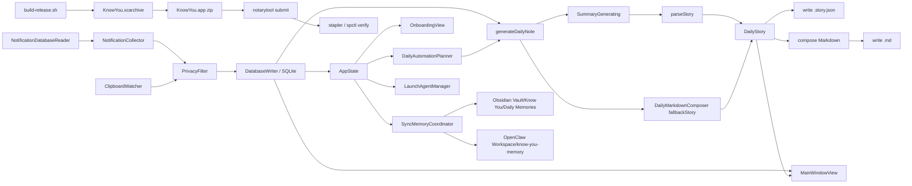

# Know You 架构文档

本文档描述当前工作区对应的真实实现架构，目标是解释系统现在如何运行，而不是定义未来版本的设想。

## 1. 项目定位

Know You 是一个原生 macOS 应用，用来被动采集用户当天的电脑上下文，并生成按天组织的日记材料。

当前实现是一个本地优先、单机运行的桌面产品，核心能力包括：

- 监听剪贴板
- 从本机 Notification Center 数据库导入通知历史
- 在落库前执行隐私过滤
- 使用 SQLite 持久化原始事件与运行记录
- 为每天生成两种输出工件：
  - `YYYY-MM-DD.story.json`：UI 主读取工件
  - `YYYY-MM-DD.md`：Markdown 导出工件
- 在主界面中以 story-first 的方式阅读每天内容，并查看段落对应的原始来源

## 2. 系统总览

当前系统由 5 层组成：

1. 采集层：剪贴板监听、通知数据库读取与导入
2. 存储与调度层：SQLite、run 记录、刷新日志、today-only 定时自动化
3. 生成层：本地 fallback story 生成、可选云端/CLI 总结器、Markdown 组合
4. 记忆同步层：Obsidian / OpenClaw 目标探测、文件复制、LaunchAgent 定时注册
5. 提醒层：晚间回顾 planner、本地通知权限与调度
6. 界面层：真实三栏阅读器上的 onboarding coachmarks、设置页、菜单栏状态入口、About & Community 对外入口
7. 分发层：Developer ID release archive、notarytool notarization、stapled zip 验证

## 2.1 发布与分发

当前项目已经补上一条独立于本地调试签名的外部分发路径：

- Release 构建使用 `Developer ID Application`
- Release 启用 hardened runtime
- 分发脚本通过 `scripts/build-release.sh`、`scripts/notarize-release.sh`、`scripts/verify-release.sh` 串起 archive、压缩、notarize、staple、Gatekeeper 验证
- Apple notarization 凭据通过本机 keychain 中的 `notarytool` profile 管理，而不是保存在仓库里

这条链路的目标是让仓库能稳定产出可上传到下载页的 macOS release zip，同时不影响 Debug/测试阶段的日常签名配置。

## 3. 运行时入口

### 3.1 App 启动

应用入口是 [KnowYouApp.swift](/Users/wutianfu/Code/know-you/KnowYou/KnowYouApp.swift)。

启动后会创建单例式的 `AppState`，并挂接三个界面入口：

- 主窗口（`WindowGroup(id: "main")`）
- 菜单栏入口
- Settings 窗口

如果用户尚未完成 onboarding，则仍然进入真实主阅读器，但会叠加 Demo Day + coachmark 引导；否则直接进入正常主阅读器。

菜单栏中的 `Open Know You` 会显式调用 `openWindow(id: "main")` 并激活应用，因此主窗口既能由正常启动拉起，也能由菜单栏重新唤起。

### 3.2 AppState 作为编排中心

[AppState.swift](/Users/wutianfu/Code/know-you/KnowYou/App/AppState.swift) 是当前实现的运行时编排中心，负责：

- 创建并持有 `AppEnvironment`
- 启动剪贴板监听
- 启动 launch-time automation、30 秒通知补同步与 3 小时定时自动化
- 维护 UI 状态与服务状态
- 管理选中日期、选中 story、选中段落及其来源事件
- 触发“按天刷新”、今日通知补同步与 today-only 自动刷新
- 持久化 onboarding 进度，并在完成后触发一次性过去 7 天 bootstrap

`AppEnvironment` 本身则负责组装主要依赖，包括数据库、隐私过滤器、采集器、composer 与 summarizer，见 [AppEnvironment.swift](/Users/wutianfu/Code/know-you/KnowYou/App/AppEnvironment.swift)。

当前 `AppState` 还负责日记引擎状态编排：

- 持有 `SummarizerConfig`
- 暴露 `defaultEngine`
- 为五个引擎维护 `engineStatuses`
- 触发 `refreshEngineStatuses()`、`retestEngine(_:)`、`retestAllEngines()`
- 保证只有绿色引擎可以成为默认项，`.none` 是唯一允许的禁用例外
- 仅当默认项当前为 `.none` 且用户没有显式保持 `None` 时，按 `Claude -> Codex -> Gemini -> Openclaw -> OpenAI` 的固定优先级自动挑选最高优先级绿色引擎

当前 `AppState` 也负责全局 diary prompt 状态：

- 持有并持久化 `SummarizerConfig.globalDiaryPromptOverride`
- 为主窗口右上角的 `Edit Prompt` sheet 提供 apply / restore default 动作
- 在真实生成路径里把已保存的全局 override 传给 `DailyMarkdownComposer.storyPrompt(...)`
- 保证该配置只影响未来的生成请求，不会因为保存 prompt 而自动刷新当前选中日期，也不会直接改写历史 `.story.json` 或 `.md`

当前 `AppState` 还负责 Sync Memory 编排：

- 持有并持久化 `SyncMemoryConfig`
- 在启动时尽力探测 Obsidian vault 与 OpenClaw workspace
- 暴露 `openSyncMemoryPanel()`、`closeSyncMemoryPanel()`、`syncMemoryNow()`
- 在用户修改自动同步配置时注册或移除用户级 `LaunchAgent`
- 通过 `SyncMemoryCoordinator` 把全部 `YYYY-MM-DD.md` 复制到外部记忆目录，并以同名覆盖方式做增量修正

当前 `AppState` 也负责晚间回顾提醒配置与通知后的前台路由：

- 持有并持久化 `EndOfDayReminderConfig`
- 持有 `[dayKey: DayReviewState]`，记录当天提醒是否已经发出
- 在 onboarding、settings 和应用启动恢复时同步通知授权状态
- 在用户启用或关闭 reminder 时安装或移除 reminder 专用用户级 `LaunchAgent`
- 在用户点击提醒通知后把 app 路由到今天，并按通知动作决定是阅读还是立即生成

晚间提醒实现目前被拆成三个边界清晰的部件：

- `LaunchAgentManager`：注册 reminder 专用 `LaunchAgent`，每天本地时区 `20:30` 启动 `KnowYou --end-of-day-reminder-now`
- `EndOfDayReminderRunner`：headless 后台执行器，读取今天 diary 是否存在，并决定发送 `review` 还是 `generate` 通知
- `EndOfDayReminderService`：通知权限查询、权限请求、稳定 request id、本地通知增删，以及提醒 payload 的 `dayKey + action`

通知权限入口目前分布在两个 UI 表面：

- `OnboardingView` 的 `permissions` 步骤会并列展示 Full Disk Access 与 Notifications，并把通知用途明确说明为 `8:30 PM daily review reminder`
- `SettingsView` 继续显示 reminder 开关、通知权限状态和测试入口；用户拒绝通知权限后，也通过这里跳转到 Notification Settings

当前 `AppState` 还负责应用更新提醒编排：

- 持有 `UpdateOffer`、`isShowingUpdateSheet`、`lastUpdateCheckAt`
- 在启动时和长时间运行中的每日检查节奏上触发更新检查
- 把 direct build 与 App Store build 的主动作分流为“打开官方下载链接”或“打开 App Store”
- 保证更新胶囊只在存在真实 offer 时显示，并且关闭 sheet 后仍继续保留

更新实现被拆成三个边界清晰的部件：

- `UpdateChannelResolver`：根据 `KYUpdateChannel` 解析当前分发渠道
- `UpdateService`：拉取远端 metadata、比较版本、生成统一的 `UpdateOffer`
- `MainWindowView.toolbar`：通过 toolbar leading 区域把 SwiftUI 胶囊稳定挂到主窗口标题栏左上角

当前默认行为是“如果构建元数据里配置了 update feed，就执行真实检查；否则安全退回 `NoopUpdateService`”。这让产品层已经具备双渠道 UI 和状态机；其中 direct 渠道当前会通过 `DirectAppUpdating` 默认实现打开远端 metadata 提供的官方下载链接，后续仍可继续桥接到 Sparkle 一类真正的自更新器。

Settings 除了状态与配置外，还承接了一组对外信息入口：

- 作者联系入口
- 社区入口或社区状态说明
- 隐私政策、使用条款、社区说明、上线清单的外部文档入口
- 版权主体摘要

## 4. 采集层

### 4.1 剪贴板采集

[ClipboardWatcher.swift](/Users/wutianfu/Code/know-you/KnowYou/Services/Clipboard/ClipboardWatcher.swift) 基于 `NSPasteboard.general` 轮询系统剪贴板。

当前实现特征：

- 以 1.5 秒为周期轮询
- 启动时会做一次 bootstrap，以便把当前剪贴板内容纳入当天内容
- 记录前台应用名作为 `sourceApp`
- 在写入前调用 `PrivacyFilter`
- 通过 `contentHash` 做去重

采集到的事件统一落为 `EventRecord`，来源类型为 `clipboard`。

### 4.2 通知采集

通知采集分为读取与导入两段：

- [NotificationDatabaseReader.swift](/Users/wutianfu/Code/know-you/KnowYou/Services/Notifications/NotificationDatabaseReader.swift)
- [NotificationCollector.swift](/Users/wutianfu/Code/know-you/KnowYou/Services/Notifications/NotificationCollector.swift)

`NotificationDatabaseReader` 负责：

- 在多个候选路径中定位 Notification Center 数据库
- 判断状态是 `available`、`permissionDenied` 还是 `missing`
- 将数据库复制到临时快照目录后只读查询，避免直接读 live DB
- 兼容两类已知 schema：`record/app` 和 `notifications/app_info`
- 从 plist payload 中递归抽取标题、正文等文本片段

`NotificationCollector` 负责：

- 将 `NotificationSnapshot` 转换为 `EventRecord`
- 在写入前执行隐私过滤
- 通过数据库写入层持久化
- 依赖 `contentHash` 与存储层去重，让重叠时间窗扫描保持幂等

通知事件的来源类型为 `notification`。

## 5. 隐私与数据边界

[PrivacyFilter.swift](/Users/wutianfu/Code/know-you/KnowYou/Services/Privacy/PrivacyFilter.swift) 是所有持久化前的统一边界。

当前规则比较直接，分为三类：

- `keep`：原文可持久化
- `redact`：对长数字做掩码后持久化
- `drop`：对明显敏感内容不保留原文，只写审计文本

当前会直接判为 `drop` 的关键词包括：

- `password`
- `otp`
- `api_key`
- `token`
- `bearer`
- `private_key`

这意味着系统遵循“先过滤，后持久化”的边界，原始敏感文本不应进入 SQLite 或最终导出工件。这个边界也会在 onboarding 的隐私与权限说明中显式解释给用户，而不是只留在实现内部。

当前完整的法律正文与社区正文并不内嵌在应用中，而是先由仓库根目录下的 Markdown 文档承载，再由 Settings 页提供外部打开入口。

## 6. 存储层

### 6.1 事件与运行记录

[DatabaseWriter.swift](/Users/wutianfu/Code/know-you/KnowYou/Services/Storage/DatabaseWriter.swift) 基于 GRDB 封装 SQLite。

当前主要职责：

- 写入事件
- 读取某一天的事件
- 记录每日生成 run
- 标记异常中断的 orphan run 为 failed
- 查询最近一次成功生成的日期

当前逻辑上至少有两类持久化对象：

- `events`
- `runs`

事件的核心结构定义在 [EventRecord.swift](/Users/wutianfu/Code/know-you/KnowYou/Domain/EventRecord.swift)：

- `id`
- `sourceType`
- `sourceApp`
- `capturedAt`
- `dayKey`
- `text`
- `auditText`
- `privacyAction`
- `contentHash`

### 6.2 文件工件

文件工件由 [AppEnvironment.swift](/Users/wutianfu/Code/know-you/KnowYou/App/AppEnvironment.swift) 写入 vault 目录。

当前默认位置：

- 数据库：`~/Library/Application Support/KnowYou/events.sqlite`
- Vault：`~/Library/Application Support/KnowYou/Vault`
- 刷新日志：`~/Library/Application Support/KnowYou/RefreshLogs`

每一天会写出两份文件：

- `YYYY-MM-DD.story.json`
- `YYYY-MM-DD.md`

其中 `.story.json` 仍是 UI 的主交互工件，`.md` 主要承担可移植导出。主阅读器会继续用 `.story.json` 里的段落和 `sourceEventIDs` 维护段落级 source link，并在正文区按 Markdown 富文本渲染 story 段落；`Source Notes` 不在中间栏显示，而是继续通过右侧来源面板承接追溯交互。onboarding 首屏与权限页都会把这个“本地 Markdown”事实直接展示给用户。

## 7. 生成层

### 7.1 DailyStory 数据模型

结构定义在 [DailyNote.swift](/Users/wutianfu/Code/know-you/KnowYou/Domain/DailyNote.swift)。

当前模型为：

- `DailyStory`
- `DailyStorySection`
- `DailyStoryParagraph`

段落级别会保留 `sourceEventIDs`，用于把故事段落映射回原始来源事件。

### 7.2 生成流程

手动刷新当前主要通过 `AppState.generateDailyNote(for:) -> refreshDayWithRetry(...)` 进入统一刷新管线，主要步骤如下：

1. 先为该天执行 day-scoped 通知同步
2. 读取 SQLite 中该天事件
3. 判断是 `fullRecovery` 还是 `incrementalUpdate`；若现有 `.story.json` 存在但读取失败，则直接失败并暴露读取错误，而不是静默降级
4. 调用结构化 summarizer；手动刷新会先尝试默认引擎，失败后再并行尝试其它绿色引擎
5. 只有合法结构化结果才写 `.story.json` 与 `.md`
6. 写入刷新日志，并更新 UI 状态、run 状态与状态栏信息

其中：

- `fullRecovery` 只在该天还没有 `provenance.generationMode == .model` 的成功 story 时发生
- `incrementalUpdate` 只把 `existingStory + 尚未写入当前 story 的新增事件` 交给增量 summarizer，不再把当天 `allEvents` 全量回传给模型
- 增量 structured payload 必须完整返回 `encouragementToReplace`、`summaryBulletsToReplace`、`detailBlocksToAppend`、`todoItemsToReplace`
- 增量合并会替换 `Encouragement` / `Summary` / `To-do`，只追加 `Details`
- 增量 payload 的 `sourceEventIDs` 至少必须属于当天已知事件集合；replacement field 出现非法引用时整次 attempt 失败，`detailBlocksToAppend` 出现非法引用时仅丢弃对应 detail block
- 任何失败都不会覆盖现有 `.story.json` 或 `.md`
- 新生成 story 的 `Details` 约定为“每个 workstream 一个 paragraph”，避免把多个 `##` 小节塞进同一个 `DailyStoryParagraph`
- `fullRecovery` 在成功解析结构化结果后，会先对 story 执行一次 `normalizeStory(...)`，再落盘
- 旧 `.story.json` 如果仍是单段 `# Details` / `# 详情` 内含多个 `##` 小节，应用会继续按旧格式读取显示；读取路径不再自动改写 `.story.json` 或 `.md`
- 旧格式拆分规则只用于新生成结果的规范化，不再作为“打开应用时的一次性迁移”执行

`generateStory(...)` 仍保留为底层 fallback/story 生成辅助能力，但不再承担主手动刷新入口语义。

不过当前实现增加了一条保护规则：如果某天已经存在 `generationMode == model` 的成功 story，而本次刷新只得到了 fallback，那么刷新会以失败结束并保留原来的 `.story.json` / `.md`，不会用 fallback 降级覆写成功内容。

如果 summarizer 成功返回结构化 JSON，`DailyStoryParagraph.text` 当前允许承载 Markdown 富文本，而不是只存纯 prose。现在的 prompt 会要求模型把当天内容组织成单个 `daily-journal` section 下的 Markdown 日记骨架，包含：

- `# 你今天做得很棒`
- `# 今日总结`
- `# 详情`
- `# 待办事项`

其中：

- `今日总结` 使用 bullet list
- `详情` 使用 `##` 二级标题组织事务线程
- `待办事项` 使用 Markdown task list

这意味着 `.story.json` 仍然维持“段落 + sourceEventIDs”的交互模型，但段落文本本身已经升级为可渲染的 Markdown 片段。

### 7.3 Fallback story

[DailyMarkdownComposer.swift](/Users/wutianfu/Code/know-you/KnowYou/Services/Composer/DailyMarkdownComposer.swift) 同时承担：

- fallback story 生成
- summarizer prompt 构造
- structured story 解析
- Markdown 组合

当前实现下，story 只有一个 section：

- `daily-journal`

fallback 逻辑会尝试把事件压缩成少量日记段落，而不是一条事件生成一段。它会基于事件主题做轻量聚类，例如：

- 主线工作内容
- 沟通/协同
- 参考资料
- 验证/工具噪音
- 生活或 logistics 片段

### 7.4 Summarizer 抽象

总结器协议定义在 [CloudSummarizer.swift](/Users/wutianfu/Code/know-you/KnowYou/Services/Summary/CloudSummarizer.swift)：

- `SummaryGenerating`

当前有两类实现：

- `CloudSummarizer`
- `CLISummarizer`

配置入口定义在 [SummarizerConfig.swift](/Users/wutianfu/Code/know-you/KnowYou/Services/Summary/SummarizerConfig.swift)，支持：

- `None`
- `OpenAI API`
- `Claude Code (CLI)`
- `Codex (CLI)`
- `Gemini (CLI)`
- `Openclaw (CLI)`

其中：

- API token 存 Keychain
- `defaultEngine`、CLI 路径、`apiBaseURL`、`apiModel` 存 UserDefaults
- `CloudSummarizer` 走 OpenAI-compatible Responses API，不再依赖启动时读取 `OPENAI_API_KEY`
- `CloudSummarizer` 已兼容 OpenAI Responses API 的两类文本返回形式：
  - 顶层 `output_text`
  - `output[].content[].text`
- `EngineProbe` 会对 CLI/API 引擎做最小 smoke test，并产出灰/黄/绿三色状态
- 若持久化的默认引擎在重启时无法证明仍可用，`AppState` 会把活动默认引擎归一到 `.none`，避免未验证引擎被直接重新激活
- 状态刷新后的自动改选只会发生在当前默认值已经是 `.none` 的情况下；明确选中的非 `None` 引擎不会被被动覆盖

## 8. 调度与自动化

[DailyAutomationPlanner.swift](/Users/wutianfu/Code/know-you/KnowYou/Services/Scheduling/DailyAutomationPlanner.swift) 现在只负责判断“今天是否允许自动增量”，不再驱动历史补跑。

自动化行为由 `AppState.startAutomation()` 触发，规则是：

- 应用启动后立即串行执行一次 `runAutomation()` 与一次 `runNotificationCatchUp()`
- `runAutomation()` 之后每 3 小时运行一次
- `runNotificationCatchUp()` 之后每 30 秒运行一次
- `runAutomation()` 先导入今天通知，再决定是否对今天执行自动增量
- `runNotificationCatchUp()` 只针对今天做通知增量导入，起点为 `max(todayStart, lastNotificationImportAt - 30 秒 overlap buffer)`
- 今天的通知水位会按数据库路径持久化；如果换库或今天还没有通知事件，旧水位会被清空
- 当今天已经存在 `provenance.generationMode == .model` 的 `.story.json` 时，自动化不再整天重建今天，而是只检查并追加尚未写入 story 的新事件
- 自动增量只处理今天；历史日期完全改为手动刷新
- 自动刷新只有单次引擎尝试，不会像手动刷新一样轮询最多 5 个绿色引擎
- 自动刷新和手动刷新都会把阶段、attempt、输出路径与结果写入 `RefreshLogs`

手动刷新与自动化现在是两条明确分离的路径：

- `refreshSelectedDay()` 永远只处理当前选中日期
- 刷新前会对该日期执行一次 day-scoped 通知同步
- 今天使用 `dayStart ... now` 时间窗
- 历史日期使用 `dayStart ... nextDayStart` 时间窗
- 如果该日已有 `model` 成功 story，则手动刷新进入增量更新；否则进入全量恢复
- 增量更新只允许追加 `Summary`、`Details`、`To-do`，不会改写 `Encouragement`
- 手动刷新失败时不会覆盖现有 `.story.json` 或 `.md`
- 手动刷新会优先尝试当前选中引擎，并在需要时按绿色引擎优先级最多重试 5 次
- 手动刷新不会复用 `DailyAutomationPlanner`，也不会顺带回补相邻日期
- 剪贴板仍然完全依赖后台 watcher；手动刷新不会尝试重建历史剪贴板记录
- 不同日期的手动刷新可以并发运行，初始并发上限为 2；同一天在已有任务进行中时不可重复触发

历史日期也可以单独刷新；当前选中日期的刷新由主窗口工具栏按钮触发。

## 9. 界面层

### 9.1 Onboarding

[OnboardingView.swift](/Users/wutianfu/Code/know-you/KnowYou/UI/Onboarding/OnboardingView.swift) 当前把 onboarding 叠加在真实主阅读器之上，由 [OnboardingContent.swift](/Users/wutianfu/Code/know-you/KnowYou/UI/Onboarding/OnboardingContent.swift) 提供 coachmark 内容，由 [OnboardingDemoStory.swift](/Users/wutianfu/Code/know-you/KnowYou/UI/Onboarding/OnboardingDemoStory.swift) 提供 Demo Day 数据。

步骤顺序固定为：

1. `demoRead`
2. `demoClick`
3. `demoReference`
4. `privacy`
5. `permissions`
6. `enginePrompt`
7. `engineSetup`
8. `generating`

这套 flow 的架构要点是：

- onboarding 直接叠加在真实三栏阅读器上，而不是切到单独的欢迎页
- 用 `OnboardingProgressState` enum，而不是整数页码，管理顺序、恢复与阻塞状态
- `demoRead` 先让用户在中栏阅读 Demo Day
- `demoClick` 要求用户点击正文段落，右侧 sources 随阅读位置联动
- `demoReference` 解释段落与 reference 的追溯关系
- `privacy` 用居中 coachmark 强调 `.md` 纯本地与“没有服务端”
- `permissions` 只 gate `Full Disk Access`，并在同位置 coachmark 里解释通知与剪贴板上下文价值
- `enginePrompt` 只负责高亮真实产品里的引擎按钮，`engineSetup` 则在现有引擎配置组件里完成默认引擎设置
- `generating` 在完成 onboarding 后自动触发一次性过去 7 天 bootstrap，而不是要求用户手动点刷新

最终完成动作只要求：

- 设置 `hasCompletedOnboarding`
- 持久化 onboarding 当前步骤，支持退出后恢复
- onboarding 完成后恢复真实列表，并自动补写过去 7 天缺失日记
- `Demo Day` 不会消失，而是作为只读 demo 项保留在左侧列表底部

当前 onboarding 的阻塞顺序是：`Demo Day -> reference -> privacy -> Full Disk Access -> engine -> generating`。

### 9.2 主阅读器

主阅读器入口在 [MainWindowView.swift](/Users/wutianfu/Code/know-you/KnowYou/UI/MainWindowView.swift)，当前是三栏结构：

- 左栏：日期列表
- 中栏：DailyStory 段落阅读
- 右栏：来源事件详情

对应子视图：

- [DateSidebarView.swift](/Users/wutianfu/Code/know-you/KnowYou/UI/Sidebar/DateSidebarView.swift)
- [DailyMarkdownView.swift](/Users/wutianfu/Code/know-you/KnowYou/UI/Reader/DailyMarkdownView.swift)

当前界面能力包括：

- 日期按 `MM-dd EEE` 格式显示
- story 段落可点击选中
- 中栏段落按 Markdown 富文本渲染，而不是原样 plain text 输出
- 中栏会根据当天语言显示显式标题：`今日小记` 或 `Story`
- 键盘或点击切换段落时，中栏会自动滚动到当前选中段落，避免选中状态离开可视区域
- 右栏展示该段落关联的原始事件
- 可展开 `View All Sources` 查看全日来源
- 右栏 source card 会在 `sourceApp` 文本前显示渠道 logo；已识别渠道优先显示本地 asset，缺失时回退到通用 symbol
- 渠道 logo 解析当前采用表驱动 alias catalog，而不是硬编码 `switch`，并已内置 100+ 个常见 global app / macOS app 品牌资产
- alias 解析会先做标准化精确匹配，再对 bundle-id 风格来源名做保守 fuzzy match，因此同一 app 的中文名、英文名和诸如 `com.tencent.xinWeChat` 这样的来源字符串都能复用同一品牌 asset
- 中栏阅读区内支持“重生成当前选中日期”
- 主界面不再依赖顶部 status banner 承载运行时状态
- 主窗口右下角会显示只读 build badge；marketing version 仍来自 bundle，build number、build time 与 git short SHA 由 Xcode build phase 写入构建产物
- 主窗口标题栏左上角通过 toolbar leading 区域显示更新胶囊，并且不会覆盖 traffic lights 的点击区域
- 当存在 `UpdateOffer` 时，点击胶囊会打开统一的更新 sheet；同一套 UI 会按渠道切换主按钮文案和动作
- 窗口右上角提供 `DiaryEngineSelectorButton`
- 一级面板列出 `Claude / Codex / Gemini / Openclaw / API` 五个引擎及状态灯
- 只有绿色引擎允许直接切为默认项
- API 行会进入 `APIDetailSheet`，配置 `baseURL`、`model`、`token` 并执行 `Test Connection`

需要注意的是，当前实现虽然在 `AppState` 中已经保存了从 `.md` 提取出来的 `selectedSourceNotesMarkdown`，但主阅读器仍然不在中栏重复显示 `Source Notes`；来源追溯继续主要通过右栏 source detail 完成。

更新提醒 UI 由以下两个新视图承担：

- [UpdatePillView.swift](/Users/wutianfu/Code/know-you/KnowYou/UI/Updates/UpdatePillView.swift)：标题栏胶囊
- [UpdateSheet.swift](/Users/wutianfu/Code/know-you/KnowYou/UI/Updates/UpdateSheet.swift)：更新详情 sheet

它们共享同一套视觉壳，但主按钮文案和主动作来自 `UpdateOffer.actionKind`，因此 direct build 与 App Store build 的交互能保持一致外观、不同动作。
当前胶囊文案固定为 `new updates`，版本号与发布时间放在更新 sheet 与右下角 build badge 中承载，而不是挤在左上角提示里。

### 9.3 键盘焦点模型

当前 `AppState` 维护两种显式焦点：

- `dateList`
- `storyParagraphs`

支持的行为包括：

- 在日期列表中上下切换日期
- 从日期列表右移进入 story
- 在 story 中上下切换段落
- 从 story 中左移回到日期列表
- 每个日期记住上次选中的段落

这意味着阅读器已经不是单纯依赖 `NavigationSplitView` 的默认焦点行为，而是有显式产品态。

### 9.4 设置页与菜单栏

[SettingsView.swift](/Users/wutianfu/Code/know-you/KnowYou/UI/Settings/SettingsView.swift) 提供：

- 服务状态检查
- Full Disk Access 跳转
- vault 目录设置
- diary engine 状态总览
- 自动化状态查看

Settings 不再承担默认引擎选择和 API token 编辑的主流程；这些操作已经迁移到主窗口右上角 selector。Settings 现在只保留次级状态总览与 vault/权限相关操作。

菜单栏入口用于：

- 查看精简状态
- 打开主窗口
- 刷新选中日期
- 进入 Settings

当前运行时状态的主出口已经收敛为 Settings 与菜单栏，而不是主阅读器顶部 banner。

## 10. 关键数据流

### 10.1 启动后的自动化与通知补同步

这条后台路径在当前实现里拆成两种节奏不同的任务：

- `runAutomation()`：启动即执行一次，随后每 3 小时执行；只负责今天的通知导入，以及“已有 model story 时的 today incremental / 没有成功 story 时的 today full recovery”
- `runNotificationCatchUp()`：启动即执行一次，随后每 30 秒执行；只负责今天的通知增量导入，不直接生成文档

两者共同保证：

- today 的通知接近实时进入本地事件库
- 重叠时间窗依赖去重，避免重复通知事件无限累积
- 历史日期不会被后台自动改写
- 若今天还没有可用引擎，自动化不会写 fallback，而是保留事件并提示用户先配置并验证引擎
- 刷新日志写失败不会中断主刷新，但会在主阅读器刷新按钮下方显示低调提示

### 10.2 用户手动刷新某一天

1. 用户在主窗口或菜单栏触发 `refreshSelectedDay()`
2. `AppState` 解析当前选中日期；若没有选中日期则回落到今天
3. `syncNotifications(for:)` 只针对该日期时间窗导入通知
4. `AppState` 先判断该日是否已有 `model` 成功 story
5. 若已有成功 story，则只把新增事件送入增量 prompt，并携带压缩后的旧内容锚点
6. 若没有成功 story，则走完整恢复式生成
7. 手动路径会先试当前引擎，再按绿色引擎优先级最多重试 5 次
8. 每次刷新都会把通知同步、事件加载、生成、写盘与 attempt 结果写入 `RefreshLogs`
9. 只有当模型返回合法结构化结果时才会原子写入 `.story.json` 与 `.md`
10. 主阅读器在刷新按钮旁以内联状态文案显示当前阶段、完成结果或错误信息
11. UI 刷新当天内容与状态信息

这条手动路径不会：

- 调用 `DailyAutomationPlanner`
- 顺带生成其他日期
- 重新导入历史剪贴板
- 在增量失败时破坏已有内容

### 10.3 用户阅读某一天

1. 用户在左侧选择日期
2. `AppState.loadDayPresentation(for:)` 读取当天事件
3. 若存在 `.story.json`，优先加载该工件
4. 否则基于事件即时构建 fallback story
5. 中栏显示段落，右栏显示段落来源事件

当 `.md` 文件存在时，`AppState` 还会尝试从中提取 `Source Notes` 区块；如果缺失，则退回到根据当天 `EventRecord` 重新生成 source-notes Markdown。这条路径当前主要用于保持导出工件与阅读器状态同步，并由测试覆盖，但 UI 仍然以右栏 source detail 为主。

### 10.4 首次用户完成 onboarding

1. 用户首次进入真实主阅读器，默认选中 `Demo Day`
2. `demoRead` / `demoClick` / `demoReference` 依次引导用户先读正文、再点段落、再理解右侧 reference
3. `privacy` 先建立 “`.md` 纯本地、无服务端” 的信任边界
4. `permissions` 只要求用户完成 `Full Disk Access`
5. `enginePrompt` 高亮右上角真实引擎按钮，用户在 `engineSetup` 中完成默认引擎设置
6. `completeOnboarding()` 写入 `hasCompletedOnboarding` 与 onboarding 进度状态
7. 应用立即触发一次性过去 7 天 bootstrap，并把缺失日期先以占位形式插入左侧列表
8. bootstrap 完成后恢复 steady-state 自动化；`Demo Day` 继续留在列表底部供用户回看

## 11. 当前架构约束

- 仅支持 macOS
- 仅支持单机、本地存储
- 通知导入依赖 macOS 是否提供可读数据库，且可能受 Full Disk Access 影响
- 某些通知横幅即使出现过，也未必被 macOS 持久化
- 当前原始事件来源只有两类：clipboard 与 notification
- story 结构当前已经简化为单 section 的日记式输出，而不是多 section 报表
- onboarding 的 `Demo Day` 使用静态叙事内容，不是从真实用户数据实时生成
- 当前 Xcode 工程对本地 Debug 构建使用手动代码签名，以减少重启后 TCC 权限丢失带来的验证噪音

## 12. 设计取向总结

当前实现的核心取向不是“做一个原始日志查看器”，而是：

- 用本地采集保证材料完整性
- 用隐私过滤守住落库边界
- 用 story 作为主阅读对象
- 用 source-linked detail 保留可追溯性
- 用 Markdown 作为可移植导出格式
- 用真实产品上的 Demo Day + coachmark 引导降低首次使用摩擦

因此，这个项目现在的本质是“以故事阅读为中心、以原始来源可追溯为底座的本地日记系统”。
