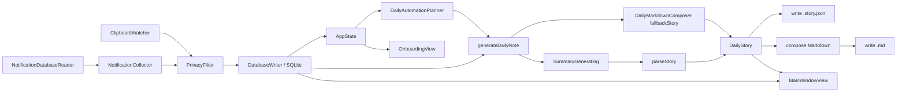
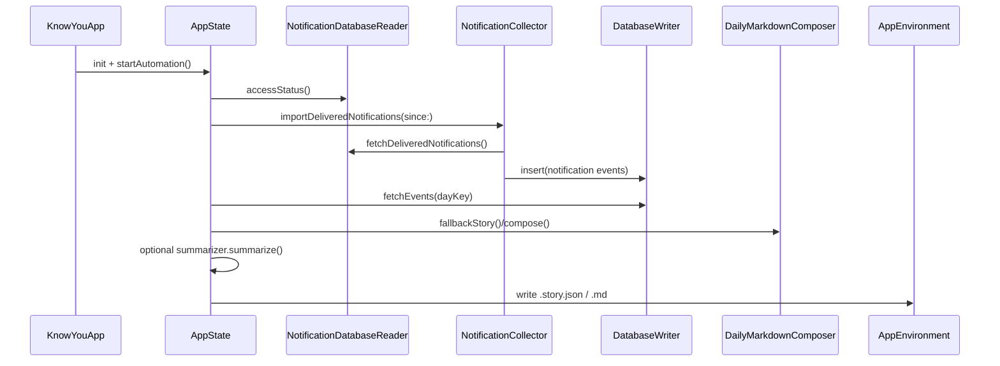

# Know You 架构文档

本文档描述当前工作区对应的真实实现架构，目标是解释系统现在如何运行，而不是定义未来版本的设想。

## 1. 项目定位

Know You 是一个原生 macOS 应用，用来被动采集用户当天的电脑上下文，并生成按天组织的日记材料。

当前实现是一个本地优先、单机运行的桌面产品，核心能力包括：

- 监听剪贴板
- 从本机 Notification Center 数据库导入通知历史
- 在落库前执行隐私过滤
- 使用 SQLite 持久化原始事件与运行记录
- 为每天生成两种输出工件：
  - `YYYY-MM-DD.story.json`：UI 主读取工件
  - `YYYY-MM-DD.md`：Markdown 导出工件
- 在主界面中以 story-first 的方式阅读每天内容，并查看段落对应的原始来源

## 2. 系统总览

当前系统由 4 层组成：

1. 采集层：剪贴板监听、通知数据库读取与导入
2. 存储与调度层：SQLite、run 记录、补跑计划、定时自动化
3. 生成层：本地 fallback story 生成、可选云端/CLI 总结器、Markdown 组合
4. 界面层：五步 story onboarding、三栏主阅读器、设置页、菜单栏状态入口、About & Community 对外入口

## 3. 运行时入口

### 3.1 App 启动

应用入口是 [KnowYouApp.swift](/Users/wutianfu/Code/know-you/KnowYou/KnowYouApp.swift)。

启动后会创建单例式的 `AppState`，并挂接三个界面入口：

- 主窗口（`WindowGroup(id: "main")`）
- 菜单栏入口
- Settings 窗口

如果用户尚未完成 onboarding，则先进入五步 story flow；否则直接进入主阅读器。

菜单栏中的 `Open Know You` 会显式调用 `openWindow(id: "main")` 并激活应用，因此主窗口既能由正常启动拉起，也能由菜单栏重新唤起。

### 3.2 AppState 作为编排中心

[AppState.swift](/Users/wutianfu/Code/know-you/KnowYou/App/AppState.swift) 是当前实现的运行时编排中心，负责：

- 创建并持有 `AppEnvironment`
- 启动剪贴板监听
- 启动 launch-time automation 与 15 分钟定时刷新
- 维护 UI 状态与服务状态
- 管理选中日期、选中 story、选中段落及其来源事件
- 触发“按天刷新”与“历史日补跑”
- 在 onboarding 完成时应用 vault 目录，并持久化完成状态

`AppEnvironment` 本身则负责组装主要依赖，包括数据库、隐私过滤器、采集器、composer 与 summarizer，见 [AppEnvironment.swift](/Users/wutianfu/Code/know-you/KnowYou/App/AppEnvironment.swift)。

当前 `AppState` 还负责日记引擎状态编排：

- 持有 `SummarizerConfig`
- 暴露 `defaultEngine`
- 为五个引擎维护 `engineStatuses`
- 触发 `refreshEngineStatuses()`、`retestEngine(_:)`、`retestAllEngines()`
- 保证只有绿色引擎可以成为默认项，`.none` 是唯一允许的禁用例外

Settings 除了状态与配置外，还承接了一组对外信息入口：

- 作者联系入口
- 社区入口或社区状态说明
- 隐私政策、使用条款、社区说明、上线清单的外部文档入口
- 版权主体摘要

## 4. 采集层

### 4.1 剪贴板采集

[ClipboardWatcher.swift](/Users/wutianfu/Code/know-you/KnowYou/Services/Clipboard/ClipboardWatcher.swift) 基于 `NSPasteboard.general` 轮询系统剪贴板。

当前实现特征：

- 以 1.5 秒为周期轮询
- 启动时会做一次 bootstrap，以便把当前剪贴板内容纳入当天内容
- 记录前台应用名作为 `sourceApp`
- 在写入前调用 `PrivacyFilter`
- 通过 `contentHash` 做去重

采集到的事件统一落为 `EventRecord`，来源类型为 `clipboard`。

### 4.2 通知采集

通知采集分为读取与导入两段：

- [NotificationDatabaseReader.swift](/Users/wutianfu/Code/know-you/KnowYou/Services/Notifications/NotificationDatabaseReader.swift)
- [NotificationCollector.swift](/Users/wutianfu/Code/know-you/KnowYou/Services/Notifications/NotificationCollector.swift)

`NotificationDatabaseReader` 负责：

- 在多个候选路径中定位 Notification Center 数据库
- 判断状态是 `available`、`permissionDenied` 还是 `missing`
- 将数据库复制到临时快照目录后只读查询，避免直接读 live DB
- 兼容两类已知 schema：`record/app` 和 `notifications/app_info`
- 从 plist payload 中递归抽取标题、正文等文本片段

`NotificationCollector` 负责：

- 将 `NotificationSnapshot` 转换为 `EventRecord`
- 在写入前执行隐私过滤
- 通过数据库写入层持久化

通知事件的来源类型为 `notification`。

## 5. 隐私与数据边界

[PrivacyFilter.swift](/Users/wutianfu/Code/know-you/KnowYou/Services/Privacy/PrivacyFilter.swift) 是所有持久化前的统一边界。

当前规则比较直接，分为三类：

- `keep`：原文可持久化
- `redact`：对长数字做掩码后持久化
- `drop`：对明显敏感内容不保留原文，只写审计文本

当前会直接判为 `drop` 的关键词包括：

- `password`
- `otp`
- `api_key`
- `token`
- `bearer`
- `private_key`

这意味着系统遵循“先过滤，后持久化”的边界，原始敏感文本不应进入 SQLite 或最终导出工件。这个边界也被 onboarding 的 `safety` 步显式解释给用户，而不是只留在实现内部。

当前完整的法律正文与社区正文并不内嵌在应用中，而是先由仓库根目录下的 Markdown 文档承载，再由 Settings 页提供外部打开入口。

## 6. 存储层

### 6.1 事件与运行记录

[DatabaseWriter.swift](/Users/wutianfu/Code/know-you/KnowYou/Services/Storage/DatabaseWriter.swift) 基于 GRDB 封装 SQLite。

当前主要职责：

- 写入事件
- 读取某一天的事件
- 记录每日生成 run
- 标记异常中断的 orphan run 为 failed
- 查询最近一次成功生成的日期

当前逻辑上至少有两类持久化对象：

- `events`
- `runs`

事件的核心结构定义在 [EventRecord.swift](/Users/wutianfu/Code/know-you/KnowYou/Domain/EventRecord.swift)：

- `id`
- `sourceType`
- `sourceApp`
- `capturedAt`
- `dayKey`
- `text`
- `auditText`
- `privacyAction`
- `contentHash`

### 6.2 文件工件

文件工件由 [AppEnvironment.swift](/Users/wutianfu/Code/know-you/KnowYou/App/AppEnvironment.swift) 写入 vault 目录。

当前默认位置：

- 数据库：`~/Library/Application Support/KnowYou/events.sqlite`
- Vault：`~/Library/Application Support/KnowYou/Vault`

每一天会写出两份文件：

- `YYYY-MM-DD.story.json`
- `YYYY-MM-DD.md`

其中 `.story.json` 仍是 UI 的主交互工件，`.md` 主要承担可移植导出。主阅读器会继续用 `.story.json` 里的段落和 `sourceEventIDs` 维护段落级 source link，并在正文区按 Markdown 富文本渲染 story 段落；`Source Notes` 不在中间栏显示，而是继续通过右侧来源面板承接追溯交互。onboarding 首屏与权限页都会把这个“本地 Markdown”事实直接展示给用户。

## 7. 生成层

### 7.1 DailyStory 数据模型

结构定义在 [DailyNote.swift](/Users/wutianfu/Code/know-you/KnowYou/Domain/DailyNote.swift)。

当前模型为：

- `DailyStory`
- `DailyStorySection`
- `DailyStoryParagraph`

段落级别会保留 `sourceEventIDs`，用于把故事段落映射回原始来源事件。

### 7.2 生成流程

`AppState.generateDailyNote(for:)` 是按天生成的核心入口，主要步骤如下：

1. 从 SQLite 读取某天全部事件
2. 先构建本地 fallback story
3. 如果配置了 summarizer，则尝试生成结构化 story
4. 如果 structured output 解析失败，则回退到本地 fallback
5. 将 story 写成 `.story.json`
6. 将 story + source events 组合成 Markdown，并写成 `.md`
7. 更新 UI 状态、run 状态与状态栏信息

因此 summarizer 是增强路径，不是首次生成内容的阻塞条件。

如果 summarizer 成功返回结构化 JSON，`DailyStoryParagraph.text` 当前允许承载 Markdown 富文本，而不是只存纯 prose。现在的 prompt 会要求模型把当天内容组织成单个 `daily-journal` section 下的 Markdown 日记骨架，包含：

- `# 你今天做得很棒`
- `# 今日总结`
- `# 详情`
- `# 待办事项`

其中：

- `今日总结` 使用 bullet list
- `详情` 使用 `##` 二级标题组织事务线程
- `待办事项` 使用 Markdown task list

这意味着 `.story.json` 仍然维持“段落 + sourceEventIDs”的交互模型，但段落文本本身已经升级为可渲染的 Markdown 片段。

### 7.3 Fallback story

[DailyMarkdownComposer.swift](/Users/wutianfu/Code/know-you/KnowYou/Services/Composer/DailyMarkdownComposer.swift) 同时承担：

- fallback story 生成
- summarizer prompt 构造
- structured story 解析
- Markdown 组合

当前实现下，story 只有一个 section：

- `daily-journal`

fallback 逻辑会尝试把事件压缩成少量日记段落，而不是一条事件生成一段。它会基于事件主题做轻量聚类，例如：

- 主线工作内容
- 沟通/协同
- 参考资料
- 验证/工具噪音
- 生活或 logistics 片段

### 7.4 Summarizer 抽象

总结器协议定义在 [CloudSummarizer.swift](/Users/wutianfu/Code/know-you/KnowYou/Services/Summary/CloudSummarizer.swift)：

- `SummaryGenerating`

当前有两类实现：

- `CloudSummarizer`
- `CLISummarizer`

配置入口定义在 [SummarizerConfig.swift](/Users/wutianfu/Code/know-you/KnowYou/Services/Summary/SummarizerConfig.swift)，支持：

- `None`
- `OpenAI API`
- `Claude Code (CLI)`
- `Codex (CLI)`
- `Gemini (CLI)`
- `Openclaw (CLI)`

其中：

- API token 存 Keychain
- `defaultEngine`、CLI 路径、`apiBaseURL`、`apiModel` 存 UserDefaults
- `CloudSummarizer` 走 OpenAI-compatible Responses API，不再依赖启动时读取 `OPENAI_API_KEY`
- `CloudSummarizer` 已兼容 OpenAI Responses API 的两类文本返回形式：
  - 顶层 `output_text`
  - `output[].content[].text`
- `EngineProbe` 会对 CLI/API 引擎做最小 smoke test，并产出灰/黄/绿三色状态
- 若持久化的默认引擎在重启时无法证明仍可用，`AppState` 会把活动默认引擎归一到 `.none`，避免未验证引擎被直接重新激活

## 8. 调度与自动化

[DailyAutomationPlanner.swift](/Users/wutianfu/Code/know-you/KnowYou/Services/Scheduling/DailyAutomationPlanner.swift) 负责决定待补跑日期。

自动化行为由 `AppState.startAutomation()` 触发，规则是：

- 应用启动后立即运行一次
- 之后每 15 分钟运行一次
- 会根据最近成功 run 与现有 note 文件推断 pending days
- 会先导入通知，再按待处理日期逐天生成 story 与 Markdown

历史日期也可以单独刷新；当前选中日期的刷新由主窗口工具栏按钮触发。

## 9. 界面层

### 9.1 Onboarding

[OnboardingView.swift](/Users/wutianfu/Code/know-you/KnowYou/UI/Onboarding/OnboardingView.swift) 当前是一个五步 story onboarding，由 [OnboardingContent.swift](/Users/wutianfu/Code/know-you/KnowYou/UI/Onboarding/OnboardingContent.swift) 提供静态叙事内容与 CTA。

步骤顺序固定为：

1. `intro`
2. `capture`
3. `safety`
4. `preview`
5. `permissions`

这套 flow 的架构要点是：

- 用 `OnboardingStep` enum，而不是整数页码，管理顺序、前后导航与进度状态
- `intro` 先给出“Markdown 保存在本机”的产品承诺
- `capture` 用时间片段解释剪贴板与通知如何自动构成一天
- `safety` 明确说明过滤发生在持久化前，且同步是可选增强
- `preview` 在权限请求之前展示接近真实阅读器的 diary preview
- `permissions` 最后解释各项权限的用户价值，并包含 vault 目录选择

最终完成动作只要求：

- 应用当前 vault 目录
- 设置 `hasCompletedOnboarding`
- 退出 onboarding 进入主界面

summarizer 不再是 onboarding 的单独步骤，也不是首次完成的阻塞项。

### 9.2 主阅读器

主阅读器入口在 [MainWindowView.swift](/Users/wutianfu/Code/know-you/KnowYou/UI/MainWindowView.swift)，当前是三栏结构：

- 左栏：日期列表
- 中栏：DailyStory 段落阅读
- 右栏：来源事件详情

对应子视图：

- [DateSidebarView.swift](/Users/wutianfu/Code/know-you/KnowYou/UI/Sidebar/DateSidebarView.swift)
- [DailyMarkdownView.swift](/Users/wutianfu/Code/know-you/KnowYou/UI/Reader/DailyMarkdownView.swift)

当前界面能力包括：

- 日期按 `MM-dd EEE` 格式显示
- story 段落可点击选中
- 中栏段落按 Markdown 富文本渲染，而不是原样 plain text 输出
- 中栏会根据当天语言显示显式标题：`今日小记` 或 `Story`
- 键盘或点击切换段落时，中栏会自动滚动到当前选中段落，避免选中状态离开可视区域
- 右栏展示该段落关联的原始事件
- 可展开 `View All Sources` 查看全日来源
- 右栏 source card 会在 `sourceApp` 文本前显示渠道 logo；已识别渠道优先显示本地 asset，缺失时回退到通用 symbol
- 中栏阅读区内支持“重生成当前选中日期”
- 主界面不再依赖顶部 status banner 承载运行时状态
- 窗口右上角提供 `DiaryEngineSelectorButton`
- 一级面板列出 `Claude / Codex / Gemini / Openclaw / API` 五个引擎及状态灯
- 只有绿色引擎允许直接切为默认项
- API 行会进入 `APIDetailSheet`，配置 `baseURL`、`model`、`token` 并执行 `Test Connection`

需要注意的是，当前实现虽然在 `AppState` 中已经保存了从 `.md` 提取出来的 `selectedSourceNotesMarkdown`，但主阅读器仍然不在中栏重复显示 `Source Notes`；来源追溯继续主要通过右栏 source detail 完成。

### 9.3 键盘焦点模型

当前 `AppState` 维护两种显式焦点：

- `dateList`
- `storyParagraphs`

支持的行为包括：

- 在日期列表中上下切换日期
- 从日期列表右移进入 story
- 在 story 中上下切换段落
- 从 story 中左移回到日期列表
- 每个日期记住上次选中的段落

这意味着阅读器已经不是单纯依赖 `NavigationSplitView` 的默认焦点行为，而是有显式产品态。

### 9.4 设置页与菜单栏

[SettingsView.swift](/Users/wutianfu/Code/know-you/KnowYou/UI/Settings/SettingsView.swift) 提供：

- 服务状态检查
- Full Disk Access 跳转
- vault 目录设置
- diary engine 状态总览
- 自动化状态查看

Settings 不再承担默认引擎选择和 API token 编辑的主流程；这些操作已经迁移到主窗口右上角 selector。Settings 现在只保留次级状态总览与 vault/权限相关操作。

菜单栏入口用于：

- 查看精简状态
- 打开主窗口
- 刷新选中日期
- 进入 Settings

当前运行时状态的主出口已经收敛为 Settings 与菜单栏，而不是主阅读器顶部 banner。

## 10. 关键数据流

### 10.1 启动后的自动刷新

### 10.2 用户阅读某一天

1. 用户在左侧选择日期
2. `AppState.loadDayPresentation(for:)` 读取当天事件
3. 若存在 `.story.json`，优先加载该工件
4. 否则基于事件即时构建 fallback story
5. 中栏显示段落，右栏显示段落来源事件

当 `.md` 文件存在时，`AppState` 还会尝试从中提取 `Source Notes` 区块；如果缺失，则退回到根据当天 `EventRecord` 重新生成 source-notes Markdown。这条路径当前主要用于保持导出工件与阅读器状态同步，并由测试覆盖，但 UI 仍然以右栏 source detail 为主。

### 10.3 首次用户完成 onboarding

1. 用户进入 `intro`，先看到本地 Markdown 承诺
2. 用户经过 `capture` 与 `safety`，理解自动采集与过滤边界
3. 用户在 `preview` 先看到 diary 结果
4. 用户在 `permissions` 处理 vault 与 Full Disk Access
5. `OnboardingView.finish()` 调用 `AppState.applyVaultURL(...)`
6. `hasCompletedOnboarding` 被写入 `UserDefaults`
7. 应用切回主阅读器，由自动化流程开始生成真实内容

## 11. 当前架构约束

- 仅支持 macOS
- 仅支持单机、本地存储
- 通知导入依赖 macOS 是否提供可读数据库，且可能受 Full Disk Access 影响
- 某些通知横幅即使出现过，也未必被 macOS 持久化
- 当前原始事件来源只有两类：clipboard 与 notification
- story 结构当前已经简化为单 section 的日记式输出，而不是多 section 报表
- onboarding preview 使用静态叙事内容，不是从真实用户数据实时生成
- 当前 Xcode 工程对本地 Debug 构建使用手动代码签名，以减少重启后 TCC 权限丢失带来的验证噪音

## 12. 设计取向总结

当前实现的核心取向不是“做一个原始日志查看器”，而是：

- 用本地采集保证材料完整性
- 用隐私过滤守住落库边界
- 用 story 作为主阅读对象
- 用 source-linked detail 保留可追溯性
- 用 Markdown 作为可移植导出格式
- 用先预览、后权限的 onboarding 叙事降低首次使用摩擦

因此，这个项目现在的本质是“以故事阅读为中心、以原始来源可追溯为底座的本地日记系统”。
